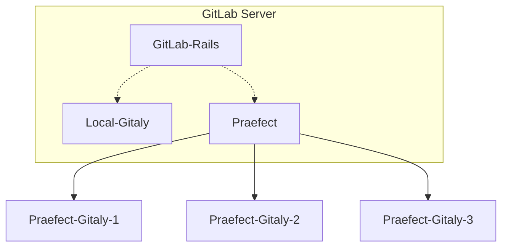

# Praefect

NOTE: **Note:** Praefect is an experimental service, and for testing purposes only at
this time.

Praefect is an optional reverse-proxy for [Gitaly](../index.md) to manage a
cluster of Gitaly nodes for high availability through replication.
If a Gitaly node becomes unavailable, it will be possible to fail over to a
warm Gitaly replica.

The first minimal version will support:

- Eventual consistency of the secondary replicas.
- Manual fail over from the primary to the secondary.

Follow the [HA Gitaly epic](https://gitlab.com/groups/gitlab-org/-/epics/1489)
for updates and roadmap.

## Omnibus

### Architecture

For this document, the following network topology is assumed:



`GitLab Server` is a standard Omnibus GitLab installation.
`Local-Gitaly` is a Gitaly daemon running on the GitLab server using local storage.
`Praefect` is also run locally and does not store any repository data. Instead,
it connects to three Gitaly nodes, `Praefect-Gitaly-1`,  `Praefect-Gitaly-2`,
and `Praefect-Gitaly-3`.

Praefect may be run on GitLab application server or on its own node; in the example below
we will run it on the GitLab server.

Praefect will handle all Gitaly RPC requests to its child nodes. However, the child nodes
will still need to communicate with the GitLab server via its internal API for authentication
purposes.

### Setup

In this setup guide we will start by configuring Praefect on the GitLab server,
then its child Gitaly nodes.

#### Configuring Praefect

First we will configure the Omnibus GitLab server to use Praefect.
Edit `/etc/gitlab/gitlab.rb` as follows:

1. Enable Praefect:

   ```ruby
   praefect['enable'] = true
   ```

1. Set Praefect to listen connections from GitLab on localhost:

   ```ruby
   praefect['listen_addr'] = 'localhost:2305'
   ```

1. Set a token for Praefect to authenticate with GitLab:

   ```ruby
   praefect['auth_token'] = 'praefect_token'

   gitlab_rails['gitaly_token'] = 'praefect_token'
   ```

1. Add praefect as a storage option for GitLab. The storage name used in `git_data_dirs`
    must match the value of `praefect['virtual_storage_name']`:

   ```ruby
   git_data_dirs({
     'praefect' => {
       'gitaly_address' => 'tcp://localhost:2305'
     },
     'default' => {
       'path' => '/var/opt/gitlab/git-data'
     }
   })

   praefect['virtual_storage_name'] = 'praefect'
   ```

1. Configure how Praefect will connect to its child Gitaly servers:

   ```ruby
   praefect['storage_nodes'] = {
     'praefect-gitaly-1' => {
       'address' => 'tcp://gitaly-1.example.com:8075',
       'token'   => 'praefect_gitaly_token',
       'primary' => true
     },
     'praefect-gitaly-2' => {
       'address' => 'tcp://gitaly-2.example.com:8075',
       'token'   => 'praefect_gitaly_token'
     },
     'praefect-gitaly-3' => {
       'address' => 'tcp://gitaly-3.example.com:8075',
       'token'   => 'praefect_gitaly_token'
     }
   }
   ```

   The `token` field for each storage is used to authenticate child Gitaly node with Praefect.
   Note that there must be one node designated as primary.

1. Save the file and [reconfigure GitLab](../restart_gitlab.md#omnibus-gitlab-reconfigure).

#### Configuring the Gitaly Servers

Next we will configure each Gitaly server assigned to Praefect.  Configuration for these
is the same as a normal standalone Gitaly server, except that we use storage names and
auth tokens from Praefect instead of GitLab.

Note that just as with a standard Gitaly server, `/etc/gitlab/gitlab-secrets.json` must
be copied from the GitLab server to the Gitaly node for authentication purposes.

`gitaly['auth_token']` must match the `token` value for that node listed under
`praefect['storage_nodes']` on the GitLab server.

1. On each gitaly server edit `/etc/gitlab/gitlab.rb` to be:

   ```ruby
   # /etc/gitlab/gitlab.rb

   # Avoid running unnecessary services on the Gitaly server
   postgresql['enable'] = false
   redis['enable'] = false
   nginx['enable'] = false
   prometheus['enable'] = false
   unicorn['enable'] = false
   sidekiq['enable'] = false
   gitlab_workhorse['enable'] = false

   # Prevent database connections during 'gitlab-ctl reconfigure'
   gitlab_rails['rake_cache_clear'] = false
   gitlab_rails['auto_migrate'] = false

   # Configure the gitlab-shell API callback URL. Without this, `git push` will
   # fail. This can be your 'front door' GitLab URL or an internal load
   # balancer.
   # Don't forget to copy `/etc/gitlab/gitlab-secrets.json` from web server to Gitaly server.
   gitlab_rails['internal_api_url'] = 'https://gitlab.example.com'

   # Authentication token to ensure only authorized servers can communicate with
   # Gitaly server
   gitaly['auth_token'] = 'praefect-gitaly-token'

   # Make Gitaly accept connections on all network interfaces. You must use
   # firewalls to restrict access to this address/port.
   # Comment out following line if you only want to support TLS connections
   gitaly['listen_addr'] = "0.0.0.0:8075"
   ```

1. Append the following for each respective server:

   * **praefect-gitaly-1**:
   ```ruby
   git_data_dirs({
     'praefect-gitaly-1' => {
       'path' => '/var/opt/gitlab/git-data'
     }
   })
   ```

   * **praefect-gitaly-2**:
   ```ruby
   git_data_dirs({
     'praefect-gitaly-2' => {
       'path' => '/var/opt/gitlab/git-data'
     }
   })
   ```
   * **praefect-gitaly-3**:
   ```ruby
   git_data_dirs({
     'praefect-gitaly-3' => {
       'path' => '/var/opt/gitlab/git-data'
     }
   })
   ```

1. Save your changes and [reconfigure the Gitaly servers](../restart_gitlab.md#omnibus-gitlab-reconfigure).

For more information on Gitaly server configuration, see our [gitaly documentation](index.md#3-gitaly-server-configuration).

### Testing Praefect

To confirm Praefect is working, first set it as the default storage node for new projects
using **Admin Area > Settings > Repository > Repository storage**. Next,
create a new project and check the "Initialize repository with a README" box.

If you receive an error, check `/var/log/gitlab/gitlab-rails/production.log`.

Here are common errors and their causes:

  * 500 response code
    * **ActionView::Template::Error (7:permission denied)**
      * `praefect['auth_token']` and `gitlab_rails['gitaly_token']` do not match on the GitLab server
    * **Unable to save project. Error: 7:permission denied**
      * Secret token in `praefect['storage_nodes']` on GitLab server does not match the 
       value in `gitaly['auth_token']` on one or more Gitaly servers
  * 503 response code
    * **GRPC::Unavailable (14:failed to connect to all addresses)**
      * GitLab was unable to reach Praefect
    * **GRPC::Unavailable (14:all SubCons are in TransientFailure...)**
      * Praefect cannot reach one or more of its child Gitaly nodes

If the project is created but the README is not, or if creating new files fails
after project creation, then ensure that the`/etc/gitlab/gitlab-secrets.json` file
from the GitLab server has been copied to the Gitaly servers and that the internal
API URL can be reached from them.
