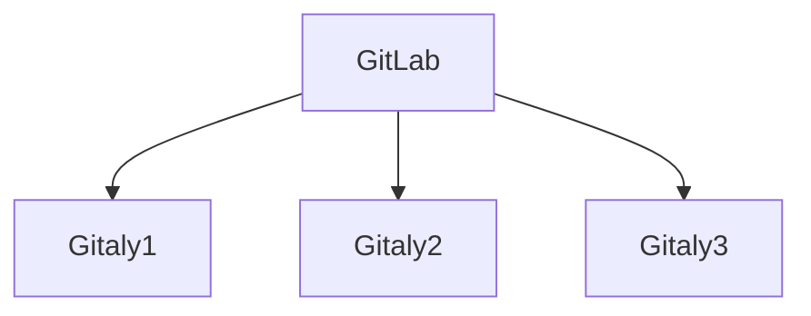

# Praefect

NOTE: **Note:** Praefect is an experimental service, and for testing purposes only at
this time.

Praefect is HA solution for [Gitaly](../index.md) to manage a
cluster of Gitaly nodes for high availability through replication.
If a Gitaly node becomes unavailable, it will be possible to fail over to a
warm Gitaly replica.

The first minimal version will support:

- Eventual consistency of the secondary replicas.
- Manual fail over from the primary to the secondary.

Follow the [HA Gitaly epic](https://gitlab.com/groups/gitlab-org/-/epics/1489)
for updates and roadmap.

## Omnibus

### Architecture

The most common architecture for Praefect is simplified in the diagram below:



Where `GitLab` is the collection of clients that can request Git operations.
Git data is stored on three Gitaly nodes, `Gitaly-1`,  `Gitaly-2`, and `Gitaly-3` that together make up one "virtual" storage.

Replication is managed by the main gitlab-rails application. When using Praefect, the Gitaly nodes send notifications back to GitLab whenever a repository changes. These notifications use the same API as the Git hooks.

### Setup

In this setup guide we will start by configuring the
Gitaly nodes, and then the GitLab server configuration.

#### Secrets

We need to manage the following secrets and make them match across hosts:

1. `GITLAB_SHELL_SECRET_TOKEN`: this is used by Git hooks to make
    callback HTTP API requests to GitLab when accepting a Git push. This
    secret is shared with GitLab Shell for legacy reasons.
1. `GITALY_SECRET_TOKEN`: this is used to authenticate to Gitaly servers.

#### Network addresses

1. `GITALY_1_ADDRESS`, `GITALY_2_ADDRESS`, `GITALY_3_ADDRESS`: the host names or IP addresses of your gitaly servers
1. `GITLAB_HTTP_URL`: the HTTPS URL to the load balancer for your GitLab installation

#### Gitaly

First we will configure each Gitaly server assigned to Praefect.  Configuration for these
is the same as a normal standalone Gitaly server, except that we also define a virtual storage.

You can use the same config file for each Gitaly server.


```ruby
# /etc/gitlab/gitlab.rb on gitaly node inside praefect cluster

# Avoid running unnecessary services on the Gitaly server
postgresql['enable'] = false
redis['enable'] = false
nginx['enable'] = false
prometheus['enable'] = false
grafana['enable'] = false
unicorn['enable'] = false
sidekiq['enable'] = false
gitlab_workhorse['enable'] = false
prometheus_monitoring['enable'] = false

# Prevent database connections during 'gitlab-ctl reconfigure'
gitlab_rails['rake_cache_clear'] = false
gitlab_rails['auto_migrate'] = false

# Replace GITLAB_SHELL_SECRET_TOKEN below with real secret
gitlab_shell['secret_token'] = 'GITLAB_SHELL_SECRET_TOKEN'

# Configure the gitlab-shell API callback URL. Without this, `git push` will
# fail. This can be your 'front door' GitLab URL or an internal load
# balancer.
gitlab_rails['internal_api_url'] = 'GITLAB_HTTP_URL'

# Make Gitaly accept connections on all network interfaces. You must use
# firewalls to restrict access to this address/port.
# Comment out following line if you only want to support TLS connections
gitaly['listen_addr'] = "0.0.0.0:8075"

gitaly['auth_token'] = 'GITALY_SECRET_TOKEN'

git_data_dirs({
  "gitaly-1" => {
    "path" => "/var/opt/gitlab/git-data"
  },
  "gitaly-2" => {
    "path" => "/var/opt/gitlab/git-data"
  },
  "gitaly-3" => {
    "path" => "/var/opt/gitlab/git-data"
  },
  "virtual-1" => {
    "path" => "/var/opt/gitlab/git-data"
  },
})
```

For more information on Gitaly server configuration, see our [Gitaly documentation](index.md#3-gitaly-server-configuration).

#### GitLab

When Praefect is running, it should be exposed as a storage to GitLab. This
is done through setting the `git_data_dirs`. Assuming the default storage
is present, there should be two storages available to GitLab:

```ruby
# /etc/gitlab/gitlab.rb on gitlab server

git_data_dirs({
  "default" => {
    "path" => "/var/opt/gitlab/git-data"
  },
  "virtual-1" => {}
})

gitlab_rails['virtual_storages'] = {
  'virtual-1' => {
    'gitaly-1' => {
      'address' => 'tcp://GITALY_1_ADDRESS:8075',
      'primary' => true
    },
    'gitaly-2' => {
      'gitaly_address' => 'tcp://GITALY_2_ADDRESS:8075',
    },
    'gitaly-3' => {
      'gitaly_address' => 'tcp://GITALY_3_ADDRESS:8075',
    }
  }
}

gitlab_rails['gitaly_token'] = 'GITALY_SECRET_TOKEN'

# Replace GITLAB_SHELL_SECRET_TOKEN below with real secret
gitlab_shell['secret_token'] = 'GITLAB_SHELL_SECRET_TOKEN'
```

Save your changes and [reconfigure GitLab](../restart_gitlab.md#omnibus-gitlab-reconfigure).

Run `gitlab-rake gitlab:gitaly:check` to confirm that GitLab can reach Praefect.

### Testing Praefect

To test Praefect, first set `virtual-1` as the default storage node for new projects
using **Admin Area > Settings > Repository > Repository storage**. Next,
create a new project and check the "Initialize repository with a README" box.

If you receive an error, check `/var/log/gitlab/gitlab-rails/production.log`.

Here are common errors and potential causes:

- 500 response code
  - **ActionView::Template::Error (7:permission denied)**
    - `praefect['auth_token']` and `gitlab_rails['gitaly_token']` do not match on the GitLab server.
  - **Unable to save project. Error: 7:permission denied**
    - Secret token in `praefect['storage_nodes']` on GitLab server does not match the
      value in `gitaly['auth_token']` on one or more Gitaly servers.
- 503 response code
  - **GRPC::Unavailable (14:failed to connect to all addresses)**
    - GitLab was unable to reach Praefect.
  - **GRPC::Unavailable (14:all SubCons are in TransientFailure...)**
    - Praefect cannot reach one or more of its child Gitaly nodes.
