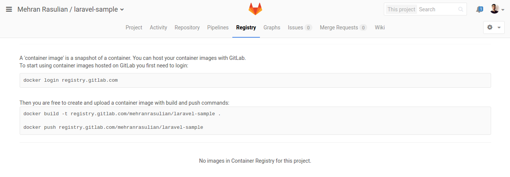
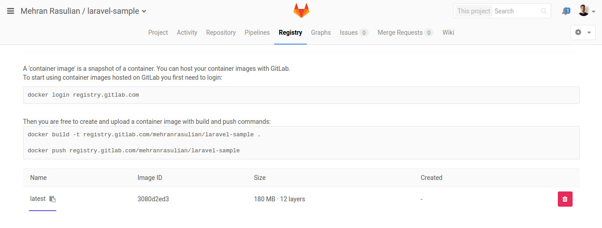
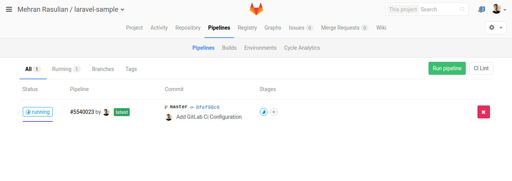
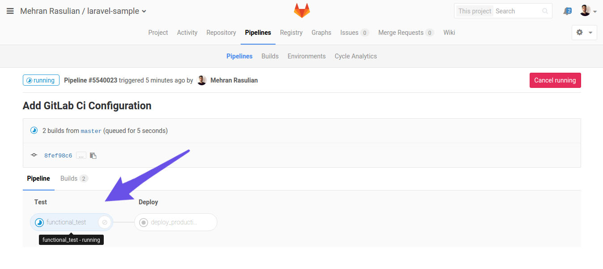
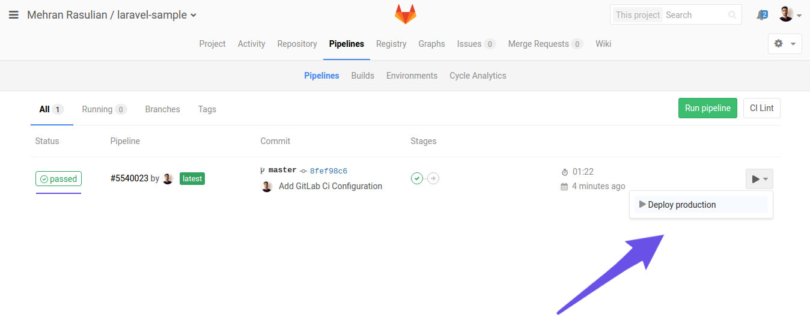
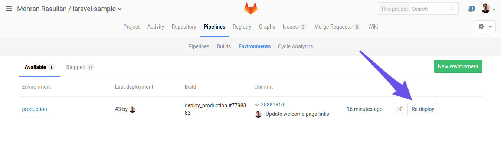
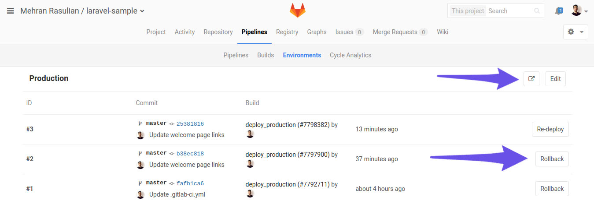
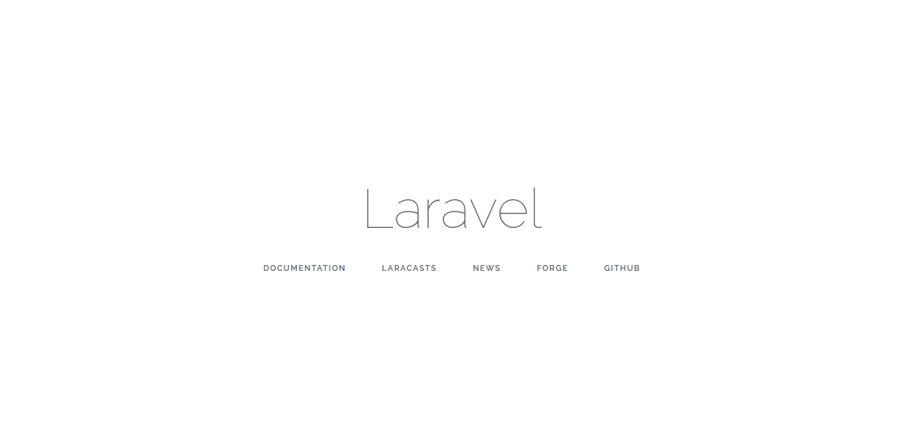
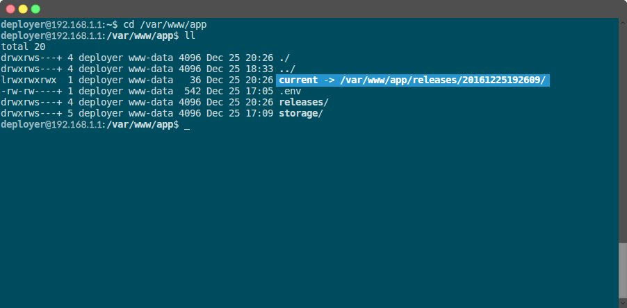
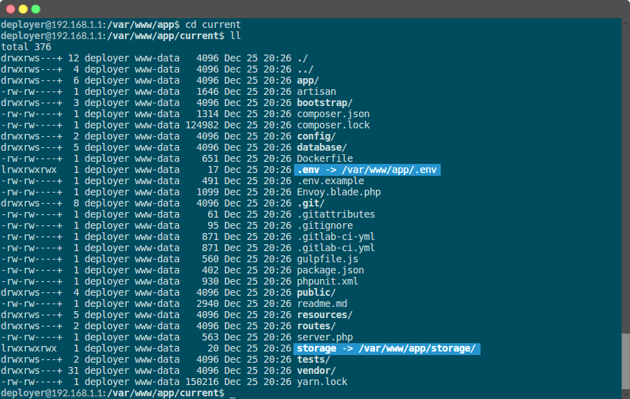

# Test and deploy Laravel applications with GitLab CI/CD and Envoy

## Introduction

GitLab features our applications with Continuous Integration, and it is possible to easily deploy the new code changes to the production server whenever we want.

In this tutorial, we'll show you how to initialize a [Laravel](https://laravel.com) application and set up our [Envoy](https://laravel.com/docs/master/envoy) tasks, then we'll jump into see how to test and deploy it with [GitLab CI/CD](../README.md) via [Continuous Delivery](https://about.gitlab.com/blog/2016/08/05/continuous-integration-delivery-and-deployment-with-gitlab/).

We assume you have a basic experience with Laravel, Linux servers,
and you know how to use GitLab.

Laravel is a high quality web framework written in PHP.
It has a great community with a [fantastic documentation](https://laravel.com/docs).
Aside from the usual routing, controllers, requests, responses, views, and (blade) templates, out of the box Laravel provides plenty of additional services such as cache, events, localization, authentication, and many others.

We will use [Envoy](https://laravel.com/docs/master/envoy) as an SSH task runner based on PHP.
It uses a clean, minimal [Blade syntax](https://laravel.com/docs/master/blade) to set up tasks that can run on remote servers, such as, cloning your project from the repository, installing the Composer dependencies, and running [Artisan commands](https://laravel.com/docs/master/artisan).

## Initialize our Laravel app on GitLab

We assume [you have installed a new Laravel project](https://laravel.com/docs/master/installation#installation), so let's start with a unit test, and initialize Git for the project.

### Unit Test

Every new installation of Laravel (currently 8.0) comes with two type of tests, 'Feature' and 'Unit', placed in the tests directory.
Here's a unit test from `test/Unit/ExampleTest.php`:

```php
<?php

namespace Tests\Unit;

...

class ExampleTest extends TestCase
{
    public function testBasicTest()
    {
        $this->assertTrue(true);
    }
}
```

This test is as simple as asserting that the given value is true.

Laravel uses `PHPUnit` for tests by default.
If we run `vendor/bin/phpunit` we should see the green output:

```shell
vendor/bin/phpunit
OK (1 test, 1 assertions)
```

This test will be used later for continuously testing our app with GitLab CI/CD.

### Push to GitLab

Since we have our app up and running locally, it's time to push the codebase to our remote repository.
Let's create [a new project](../../../gitlab-basics/create-project.md) in GitLab named `laravel-sample`.
After that, follow the command line instructions displayed on the project's homepage to initiate the repository on our machine and push the first commit.

```shell
cd laravel-sample
git init
git remote add origin git@gitlab.example.com:<USERNAME>/laravel-sample.git
git add .
git commit -m 'Initial Commit'
git push -u origin master
```

## Configure the production server

Before we begin setting up Envoy and GitLab CI/CD, let's quickly make sure the production server is ready for deployment.
We have installed LEMP stack which stands for Linux, NGINX, MySQL, and PHP on our Ubuntu 16.04.

### Create a new user

Let's now create a new user that will be used to deploy our website and give it
the needed permissions using [Linux ACL](https://serversforhackers.com/c/linux-acls):

```shell
# Create user deployer
sudo adduser deployer
# Give the read-write-execute permissions to deployer user for directory /var/www
sudo setfacl -R -m u:deployer:rwx /var/www
```

If you don't have ACL installed on your Ubuntu server, use this command to install it:

```shell
sudo apt install acl
```

### Add SSH key

Let's suppose we want to deploy our app to the production server from a private repository on GitLab. First, we need to [generate a new SSH key pair **with no passphrase**](../../../ssh/README.md) for the deployer user.

After that, we need to copy the private key, which will be used to connect to our server as the deployer user with SSH, to be able to automate our deployment process:

```shell
# As the deployer user on server
#
# Copy the content of public key to authorized_keys
cat ~/.ssh/id_rsa.pub >> ~/.ssh/authorized_keys
# Copy the private key text block
cat ~/.ssh/id_rsa
```

Now, let's add it to your GitLab project as a [variable](../../variables/README.md#gitlab-cicd-environment-variables).
Variables are user-defined variables and are stored out of `.gitlab-ci.yml`, for security purposes.
They can be added per project by navigating to the project's **Settings** > **CI/CD**.

To the field **KEY**, add the name `SSH_PRIVATE_KEY`, and to the **VALUE** field, paste the private key you've copied earlier.
We'll use this variable in the `.gitlab-ci.yml` later, to easily connect to our remote server as the deployer user without entering its password.


We also need to add the public key to **Project** > **Settings** > **Repository** as a [Deploy Key](../../../ssh/README.md#deploy-keys), which gives us the ability to access our repository from the server through [SSH protocol](../../../gitlab-basics/command-line-commands.md#start-working-on-your-project).

```shell
# As the deployer user on the server
#
# Copy the public key
cat ~/.ssh/id_rsa.pub
```

To the field **Title**, add any name you want, and paste the public key into the **Key** field.


Now, let's clone our repository on the server just to make sure the `deployer` user has access to the repository.

```shell
# As the deployer user on server
#
git clone git@gitlab.example.com:<USERNAME>/laravel-sample.git
```

NOTE: **Note:**
Answer **yes** if asked `Are you sure you want to continue connecting (yes/no)?`.
It adds GitLab.com to the known hosts.

### Configuring NGINX

Now, let's make sure our web server configuration points to the `current/public` rather than `public`.

Open the default NGINX server block configuration file by typing:

```shell
sudo nano /etc/nginx/sites-available/default
```

The configuration should be like this.

```nginx
server {
    root /var/www/app/current/public;
    server_name example.com;
    # Rest of the configuration
}
```

NOTE: **Note:**
You may replace the app's name in `/var/www/app/current/public` with the folder name of your application.

## Setting up Envoy

So we have our Laravel app ready for production.
The next thing is to use Envoy to perform the deploy.

To use Envoy, we should first install it on our local machine [using the given instructions by Laravel](https://laravel.com/docs/master/envoy/#introduction).

### How Envoy works

The pros of Envoy is that it doesn't require Blade engine, it just uses Blade syntax to define tasks.
To start, we create an `Envoy.blade.php` in the root of our app with a simple task to test Envoy.

```php
@servers(['web' => 'remote_username@remote_host'])

@task('list', ['on' => 'web'])
    ls -l
@endtask
```

As you may expect, we have an array within `@servers` directive at the top of the file, which contains a key named `web` with a value of the server's address (for example, `deployer@192.168.1.1`).
Then within our `@task` directive we define the bash commands that should be run on the server when the task is executed.

On the local machine use the `run` command to run Envoy tasks.

```shell
envoy run list
```

It should execute the `list` task we defined earlier, which connects to the server and lists directory contents.

Envoy is not a dependency of Laravel, therefore you can use it for any PHP application.

### Zero downtime deployment

Every time we deploy to the production server, Envoy downloads the latest release of our app from GitLab repository and replace it with preview's release.
Envoy does this without any [downtime](https://en.wikipedia.org/wiki/Downtime),
so we don't have to worry during the deployment while someone might be reviewing the site.
Our deployment plan is to clone the latest release from GitLab repository, install the Composer dependencies and finally, activate the new release.

#### @setup directive

The first step of our deployment process is to define a set of variables within [@setup](https://laravel.com/docs/master/envoy/#setup) directive.
You may change the `app` to your application's name:

```php
...

@setup
    $repository = 'git@gitlab.example.com:<USERNAME>/laravel-sample.git';
    $releases_dir = '/var/www/app/releases';
    $app_dir = '/var/www/app';
    $release = date('YmdHis');
    $new_release_dir = $releases_dir .'/'. $release;
@endsetup

...
```

- `$repository` is the address of our repository
- `$releases_dir` directory is where we deploy the app
- `$app_dir` is the actual location of the app that is live on the server
- `$release` contains a date, so every time that we deploy a new release of our app, we get a new folder with the current date as name
- `$new_release_dir` is the full path of the new release which is used just to make the tasks cleaner

#### @story directive

The [@story](https://laravel.com/docs/master/envoy/#stories) directive allows us define a list of tasks that can be run as a single task.
Here we have three tasks called `clone_repository`, `run_composer`, `update_symlinks`. These variables are usable to making our task's codes more cleaner:

```php
...

@story('deploy')
    clone_repository
    run_composer
    update_symlinks
@endstory

...
```

Let's create these three tasks one by one.

#### Clone the repository

The first task will create the `releases` directory (if it doesn't exist), and then clone the `master` branch of the repository (by default) into the new release directory, given by the `$new_release_dir` variable.
The `releases` directory will hold all our deployments:

```php
...

@task('clone_repository')
    echo 'Cloning repository'
    [ -d {{ $releases_dir }} ] || mkdir {{ $releases_dir }}
    git clone --depth 1 {{ $repository }} {{ $new_release_dir }}
    cd {{ $new_release_dir }}
    git reset --hard {{ $commit }}
@endtask

...
```

While our project grows, its Git history will be very long over time.
Since we are creating a directory per release, it might not be necessary to have the history of the project downloaded for each release.
The `--depth 1` option is a great solution which saves systems time and disk space as well.

#### Installing dependencies with Composer

As you may know, this task just navigates to the new release directory and runs Composer to install the application dependencies:

```php
...

@task('run_composer')
    echo "Starting deployment ({{ $release }})"
    cd {{ $new_release_dir }}
    composer install --prefer-dist --no-scripts -q -o
@endtask

...
```

#### Activate new release

Next thing to do after preparing the requirements of our new release, is to remove the storage directory from it and to create two symbolic links to point the application's `storage` directory and `.env` file to the new release.
Then, we need to create another symbolic link to the new release with the name of `current` placed in the app directory.
The `current` symbolic link always points to the latest release of our app:

```php
...

@task('update_symlinks')
    echo "Linking storage directory"
    rm -rf {{ $new_release_dir }}/storage
    ln -nfs {{ $app_dir }}/storage {{ $new_release_dir }}/storage

    echo 'Linking .env file'
    ln -nfs {{ $app_dir }}/.env {{ $new_release_dir }}/.env

    echo 'Linking current release'
    ln -nfs {{ $new_release_dir }} {{ $app_dir }}/current
@endtask
```

As you see, we use `-nfs` as an option for `ln` command, which says that the `storage`, `.env` and `current` no longer points to the preview's release and will point them to the new release by force (`f` from `-nfs` means force), which is the case when we are doing multiple deployments.

### Full script

The script is ready, but make sure to change the `deployer@192.168.1.1` to your server and also change `/var/www/app` with the directory you want to deploy your app.

At the end, our `Envoy.blade.php` file will look like this:

```php
@servers(['web' => 'deployer@192.168.1.1'])

@setup
    $repository = 'git@gitlab.example.com:<USERNAME>/laravel-sample.git';
    $releases_dir = '/var/www/app/releases';
    $app_dir = '/var/www/app';
    $release = date('YmdHis');
    $new_release_dir = $releases_dir .'/'. $release;
@endsetup

@story('deploy')
    clone_repository
    run_composer
    update_symlinks
@endstory

@task('clone_repository')
    echo 'Cloning repository'
    [ -d {{ $releases_dir }} ] || mkdir {{ $releases_dir }}
    git clone --depth 1 {{ $repository }} {{ $new_release_dir }}
    cd {{ $new_release_dir }}
    git reset --hard {{ $commit }}
@endtask

@task('run_composer')
    echo "Starting deployment ({{ $release }})"
    cd {{ $new_release_dir }}
    composer install --prefer-dist --no-scripts -q -o
@endtask

@task('update_symlinks')
    echo "Linking storage directory"
    rm -rf {{ $new_release_dir }}/storage
    ln -nfs {{ $app_dir }}/storage {{ $new_release_dir }}/storage

    echo 'Linking .env file'
    ln -nfs {{ $app_dir }}/.env {{ $new_release_dir }}/.env

    echo 'Linking current release'
    ln -nfs {{ $new_release_dir }} {{ $app_dir }}/current
@endtask
```

One more thing we should do before any deployment is to manually copy our application `storage` folder to the `/var/www/app` directory on the server for the first time.
You might want to create another Envoy task to do that for you.
We also create the `.env` file in the same path to set up our production environment variables for Laravel.
These are persistent data and will be shared to every new release.

Now, we would need to deploy our app by running `envoy run deploy`, but it won't be necessary since GitLab can handle that for us with CI's [environments](../../environments/index.md), which will be described [later](#setting-up-gitlab-cicd) in this tutorial.

Now it's time to commit [Envoy.blade.php](https://gitlab.com/mehranrasulian/laravel-sample/blob/master/Envoy.blade.php) and push it to the `master` branch.
To keep things simple, we commit directly to `master`, without using [feature-branches](../../../topics/gitlab_flow.md#github-flow-as-a-simpler-alternative) since collaboration is beyond the scope of this tutorial.
In a real world project, teams may use [Issue Tracker](../../../user/project/issues/index.md) and [Merge Requests](../../../user/project/merge_requests/index.md) to move their code across branches:

```shell
git add Envoy.blade.php
git commit -m 'Add Envoy'
git push origin master
```

## Continuous Integration with GitLab

We have our app ready on GitLab, and we also can deploy it manually.
But let's take a step forward to do it automatically with [Continuous Delivery](https://about.gitlab.com/blog/2016/08/05/continuous-integration-delivery-and-deployment-with-gitlab/#continuous-delivery) method.
We need to check every commit with a set of automated tests to become aware of issues at the earliest, and then, we can deploy to the target environment if we are happy with the result of the tests.

[GitLab CI/CD](../../README.md) allows us to use [Docker](https://www.docker.com) engine to handle the process of testing and deploying our app.
In case you're not familiar with Docker, refer to [Set up automated builds](https://docs.docker.com/get-started/).

To be able to build, test, and deploy our app with GitLab CI/CD, we need to prepare our work environment.
To do that, we'll use a Docker image which has the minimum requirements that a Laravel app needs to run.
[There are other ways](../php.md#test-php-projects-using-the-docker-executor) to do that as well, but they may lead our builds run slowly, which is not what we want when there are faster options to use.

With Docker images our builds run incredibly faster!

### Create a Container Image

Let's create a [Dockerfile](https://gitlab.com/mehranrasulian/laravel-sample/blob/master/Dockerfile) in the root directory of our app with the following content:

```shell
# Set the base image for subsequent instructions
FROM php:7.4

# Update packages
RUN apt-get update

# Install PHP and composer dependencies
RUN apt-get install -qq git curl libmcrypt-dev libjpeg-dev libpng-dev libfreetype6-dev libbz2-dev

# Clear out the local repository of retrieved package files
RUN apt-get clean

# Install needed extensions
# Here you can install any other extension that you need during the test and deployment process
RUN docker-php-ext-install mcrypt pdo_mysql zip

# Install Composer
RUN curl --silent --show-error https://getcomposer.org/installer | php -- --install-dir=/usr/local/bin --filename=composer

# Install Laravel Envoy
RUN composer global require "laravel/envoy=~1.0"
```

We added the [official PHP 7.4 Docker image](https://hub.docker.com/_/php), which consist of a minimum installation of Debian buster with PHP pre-installed, and works perfectly for our use case.

We used `docker-php-ext-install` (provided by the official PHP Docker image) to install the PHP extensions we need.

#### Setting Up GitLab Container Registry

Now that we have our `Dockerfile` let's build and push it to our [GitLab Container Registry](../../../user/packages/container_registry/index.md).

> The registry is the place to store and tag images for later use. Developers may want to maintain their own registry for private, company images, or for throw-away images used only in testing. Using GitLab Container Registry means you don't need to set up and administer yet another service or use a public registry.

On your GitLab project repository navigate to the **Registry** tab.



You may need to [enable Container Registry](../../../user/packages/container_registry/index.md#enable-the-container-registry-for-your-project) to your project to see this tab. You'll find it under your project's **Settings > General > Visibility, project features, permissions**.

To start using Container Registry on our machine, we first need to login to the GitLab registry using our GitLab username and password:

```shell
docker login registry.gitlab.com
```

Then we can build and push our image to GitLab:

```shell
docker build -t registry.gitlab.com/<USERNAME>/laravel-sample .

docker push registry.gitlab.com/<USERNAME>/laravel-sample
```

NOTE: **Note:**
To run the above commands, we first need to have [Docker](https://docs.docker.com/engine/installation/) installed on our machine.

Congratulations! You just pushed the first Docker image to the GitLab Registry, and if you refresh the page you should be able to see it:



NOTE: **Note:**
You can also [use GitLab CI/CD](https://about.gitlab.com/blog/2016/05/23/gitlab-container-registry/#use-with-gitlab-ci) to build and push your Docker images, rather than doing that on your machine.

We'll use this image further down in the `.gitlab-ci.yml` configuration file to handle the process of testing and deploying our app.

Let's commit the `Dockerfile` file.

```shell
git add Dockerfile
git commit -m 'Add Dockerfile'
git push origin master
```

### Setting up GitLab CI/CD

In order to build and test our app with GitLab CI/CD, we need a file called `.gitlab-ci.yml` in our repository's root. It is similar to Circle CI and Travis CI, but built-in GitLab.

Our `.gitlab-ci.yml` file will look like this:

```yaml
image: registry.gitlab.com/<USERNAME>/laravel-sample:latest

services:
  - mysql:5.7

variables:
  MYSQL_DATABASE: homestead
  MYSQL_ROOT_PASSWORD: secret
  DB_HOST: mysql
  DB_USERNAME: root

stages:
  - test
  - deploy

unit_test:
  stage: test
  script:
    - cp .env.example .env
    - composer install
    - php artisan key:generate
    - php artisan migrate
    - vendor/bin/phpunit

deploy_production:
  stage: deploy
  script:
    - 'which ssh-agent || ( apt-get update -y && apt-get install openssh-client -y )'
    - eval $(ssh-agent -s)
    - ssh-add <(echo "$SSH_PRIVATE_KEY")
    - mkdir -p ~/.ssh
    - '[[ -f /.dockerenv ]] && echo -e "Host *\n\tStrictHostKeyChecking no\n\n" > ~/.ssh/config'

    - ~/.composer/vendor/bin/envoy run deploy --commit="$CI_COMMIT_SHA"
  environment:
    name: production
    url: http://192.168.1.1
  when: manual
  only:
    - master
```

That's a lot to take in, isn't it? Let's run through it step by step.

#### Image and Services

[Runners](../../runners/README.md) run the script defined by `.gitlab-ci.yml`.
The `image` keyword tells the runners which image to use.
The `services` keyword defines additional images [that are linked to the main image](../../docker/using_docker_images.md#what-is-a-service).
Here we use the container image we created before as our main image and also use MySQL 5.7 as a service.

```yaml
image: registry.gitlab.com/<USERNAME>/laravel-sample:latest

services:
  - mysql:5.7

...
```

NOTE: **Note:**
If you wish to test your app with different PHP versions and [database management systems](../../services/README.md), you can define different `image` and `services` keywords for each test job.

#### Variables

GitLab CI/CD allows us to use [environment variables](../../yaml/README.md#variables) in our jobs.
We defined MySQL as our database management system, which comes with a superuser root created by default.

So we should adjust the configuration of MySQL instance by defining `MYSQL_DATABASE` variable as our database name and `MYSQL_ROOT_PASSWORD` variable as the password of `root`.
Find out more about MySQL variables at the [official MySQL Docker Image](https://hub.docker.com/_/mysql).

Also set the variables `DB_HOST` to `mysql` and `DB_USERNAME` to `root`, which are Laravel specific variables.
We define `DB_HOST` as `mysql` instead of `127.0.0.1`, as we use MySQL Docker image as a service which [is linked to the main Docker image](../../docker/using_docker_images.md#how-services-are-linked-to-the-job).

```yaml
variables:
  MYSQL_DATABASE: homestead
  MYSQL_ROOT_PASSWORD: secret
  DB_HOST: mysql
  DB_USERNAME: root
```

#### Unit Test as the first job

We defined the required shell scripts as an array of the [script](../../yaml/README.md#script) variable to be executed when running `unit_test` job.

These scripts are some Artisan commands to prepare the Laravel, and, at the end of the script, we'll run the tests by `PHPUnit`.

```yaml
unit_test:
  script:
    # Install app dependencies
    - composer install
    # Set up .env
    - cp .env.example .env
    # Generate an environment key
    - php artisan key:generate
    # Run migrations
    - php artisan migrate
    # Run tests
    - vendor/bin/phpunit
```

#### Deploy to production

The job `deploy_production` will deploy the app to the production server.
To deploy our app with Envoy, we had to set up the `$SSH_PRIVATE_KEY` variable as an [SSH private key](../../ssh_keys/README.md#ssh-keys-when-using-the-docker-executor).
If the SSH keys have added successfully, we can run Envoy.

As mentioned before, GitLab supports [Continuous Delivery](https://about.gitlab.com/blog/2016/08/05/continuous-integration-delivery-and-deployment-with-gitlab/#continuous-delivery) methods as well.
The [environment](../../yaml/README.md#environment) keyword tells GitLab that this job deploys to the `production` environment.
The `url` keyword is used to generate a link to our application on the GitLab Environments page.
The `only` keyword tells GitLab CI/CD that the job should be executed only when the pipeline is building the `master` branch.
Lastly, `when: manual` is used to turn the job from running automatically to a manual action.

```yaml
deploy_production:
  script:
    # Add the private SSH key to the build environment
    - 'which ssh-agent || ( apt-get update -y && apt-get install openssh-client -y )'
    - eval $(ssh-agent -s)
    - ssh-add <(echo "$SSH_PRIVATE_KEY")
    - mkdir -p ~/.ssh
    - '[[ -f /.dockerenv ]] && echo -e "Host *\n\tStrictHostKeyChecking no\n\n" > ~/.ssh/config'

    # Run Envoy
    - ~/.composer/vendor/bin/envoy run deploy

  environment:
    name: production
    url: http://192.168.1.1
  when: manual
  only:
    - master
```

You may also want to add another job for [staging environment](https://about.gitlab.com/blog/2016/08/26/ci-deployment-and-environments/), to final test your application before deploying to production.

### Turn on GitLab CI/CD

We have prepared everything we need to test and deploy our app with GitLab CI/CD.
To do that, commit and push `.gitlab-ci.yml` to the `master` branch. It will trigger a pipeline, which you can watch live under your project's **Pipelines**.



Here we see our **Test** and **Deploy** stages.
The **Test** stage has the `unit_test` build running.
click on it to see the runner's output.



After our code passed through the pipeline successfully, we can deploy to our production server by clicking the **play** button on the right side.



Once the deploy pipeline passed successfully, navigate to **Pipelines > Environments**.



If something doesn't work as expected, you can roll back to the latest working version of your app.



By clicking on the external link icon specified on the right side, GitLab opens the production website.
Our deployment successfully was done and we can see the application is live.



In the case that you're interested to know how is the application directory structure on the production server after deployment, here are three directories named `current`, `releases` and `storage`.
As you know, the `current` directory is a symbolic link that points to the latest release.
The `.env` file consists of our Laravel environment variables.



If you navigate to the `current` directory, you should see the application's content.
As you see, the `.env` is pointing to the `/var/www/app/.env` file and also `storage` is pointing to the `/var/www/app/storage/` directory.



## Conclusion

We configured GitLab CI/CD to perform automated tests and used the method of [Continuous Delivery](https://continuousdelivery.com/) to deploy to production a Laravel application with Envoy, directly from the codebase.

Envoy also was a great match to help us deploy the application without writing our custom bash script and doing Linux magics.
