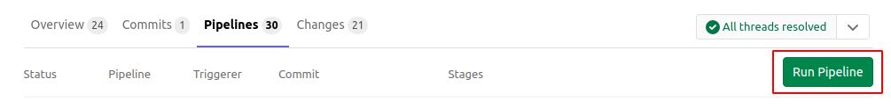
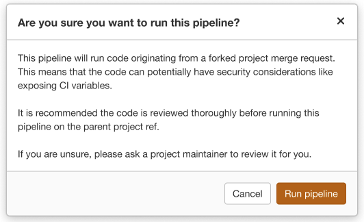

# Pipelines for Merge Requests

> [Introduced](https://gitlab.com/gitlab-org/gitlab-foss/-/issues/15310) in GitLab 11.6.

In a [basic configuration](../pipelines/pipeline_architectures.md#basic-pipelines), GitLab runs a pipeline each time
changes are pushed to a branch.

If you want the pipeline to run jobs **only** when merge requests are created or updated,
you can use *pipelines for merge requests*.

In the UI, these pipelines are labeled as `detached`. Otherwise, these pipelines appear the same
as other pipelines.

Any user who has developer [permissions](../../user/permissions.md)
can run a pipeline for merge requests.


NOTE: **Note**:
If you use this feature with [merge when pipeline succeeds](../../user/project/merge_requests/merge_when_pipeline_succeeds.md),
pipelines for merge requests take precedence over the other regular pipelines.

## Prerequisites

To enable pipelines for merge requests:

- Your repository must be a GitLab repository, not an
  [external repository](../ci_cd_for_external_repos/index.md).
- [In GitLab 11.10 and later](https://gitlab.com/gitlab-org/gitlab-foss/-/merge_requests/25504),
  you must be using GitLab Runner 11.9.

## Configuring pipelines for merge requests

To configure pipelines for merge requests you need to configure your [CI/CD configuration file](../yaml/README.md).
There are a few different ways to do this:

### Use `rules` to run pipelines for merge requests

When using `rules`, which is the preferred method, we recommend starting with one
of the [`workflow:rules` templates](../yaml/README.md#workflowrules-templates) to ensure
your basic configuration is correct. Instructions on how to do this, as well as how
to customize, are available at that link.

### Use `only` or `except` to run pipelines for merge requests

If you want to continue using `only/except`, this is possible but please review the drawbacks
below.

When you use this method, you have to specify `only: - merge_requests` for each job. In this
example, the pipeline contains a `test` job that is configured to run on merge requests.

The `build` and `deploy` jobs don't have the `only: - merge_requests` parameter,
so they will not run on merge requests.

```yaml
build:
  stage: build
  script: ./build
  only:
    - master

test:
  stage: test
  script: ./test
  only:
    - merge_requests

deploy:
  stage: deploy
  script: ./deploy
  only:
    - master
```

#### Excluding certain jobs

The behavior of the `only: [merge_requests]` parameter is such that _only_ jobs with
that parameter are run in the context of a merge request; no other jobs will be run.

However, you can invert this behavior and have all of your jobs run _except_
for one or two.

Consider the following pipeline, with jobs `A`, `B`, and `C`. Imagine you want:

- All pipelines to always run `A` and `B`.
- `C` to run only for merge requests.

To achieve this, you can configure your `.gitlab-ci.yml` file as follows:

``` yaml
.only-default: &only-default
  only:
    - master
    - merge_requests
    - tags

A:
  <<: *only-default
  script:
    - ...

B:
  <<: *only-default
  script:
    - ...

C:
  script:
    - ...
  only:
    - merge_requests
```

Therefore:

- Since `A` and `B` are getting the `only:` rule to execute in all cases, they will always run.
- Since `C` specifies that it should only run for merge requests, it will not run for any pipeline
  except a merge request pipeline.

This helps you avoid having to add the `only:` rule to all of your jobs
in order to make them always run. You can use this format to set up a Review App, helping to save resources.

#### Excluding certain branches

Pipelines for merge requests require special treatment when
using [`only`/`except`](../yaml/README.md#onlyexcept-basic). Unlike ordinary
branch refs (for example `refs/heads/my-feature-branch`), merge request refs
use a special Git reference that looks like `refs/merge-requests/:iid/head`. Because
of this, the following configuration will **not** work as expected:

```yaml
# Does not exclude a branch named "docs-my-fix"!
test:
  only: [merge_requests]
  except: [/^docs-/]
```

Instead, you can use the
[`$CI_COMMIT_REF_NAME` predefined environment
variable](../variables/predefined_variables.md) in
combination with
[`only:variables`](../yaml/README.md#onlyvariablesexceptvariables) to
accomplish this behavior:

```yaml
test:
  only: [merge_requests]
  except:
    variables:
      - $CI_COMMIT_REF_NAME =~ /^docs-/
```

## Pipelines for Merged Results **(PREMIUM)**

Read the [documentation on Pipelines for Merged Results](pipelines_for_merged_results/index.md).

### Merge Trains **(PREMIUM)**

Read the [documentation on Merge Trains](pipelines_for_merged_results/merge_trains/index.md).

## Create pipelines in the parent project for merge requests from a forked project

> [Introduced](https://gitlab.com/gitlab-org/gitlab/-/issues/217451) in GitLab 13.2.

By default, external contibutors do not have permission to create pipelines in the
parent project. When a pipeline for merge request is triggered by one of them, it's
always created in the fork project instead of the parent project, and consumes the fork
project's CI config/resource for running pipelines. However, there are some cases that
parent project members want to create a pipeline in a parent project in order to ensure that the post-merge pipeline will pass in the parent project,
for example, a fork project could be using a corrupted runner that doesn't execute test scripts properly,
and parent project members might mistakenly trust the merge request with a fake-successful pipeline.

As of GitLab 13.2, parent project members can create pipelines in the parent project
for merge requests from a forked project.
To create a pipeline, visit **Merge Requests > Pipelines Tab** and click **Run Pipeline** button.



Please note that fork merge requests could contain a malicious code to try to steal secrets
in the parent project. You have to carefully review the changes of the merge request before actually
triggering the pipeline. Gitlab shows the following warning to the pipeline triggerer
not to miss this important security implication.



## Additional predefined variables

By using pipelines for merge requests, GitLab exposes additional predefined variables to the pipeline jobs.
Those variables contain information of the associated merge request, so that it's useful
to integrate your job with [GitLab Merge Request API](../../api/merge_requests.md).

You can find the list of available variables in [the reference sheet](../variables/predefined_variables.md).
The variable names begin with the `CI_MERGE_REQUEST_` prefix.

## Troubleshooting

### Two pipelines created when pushing to a merge request

If you are experiencing duplicated pipelines when using `rules`, take a look at
the [important differences between `rules` and `only`/`except`](../yaml/README.md#differences-between-rules-and-onlyexcept),
which will help you get your starting configuration correct.

If you are seeing two pipelines when using `only/except`, please see the caveats
related to using `only/except` above (or, consider moving to `rules`).

### Two pipelines created when pushing an invalid CI configuration file

Pushing to a branch with an invalid CI configuration file can trigger
the creation of two types of failed pipelines. One pipeline is a failed merge request
pipeline, and the other is a failed branch pipeline, but both are caused by the same
invalid configuration.

In rare cases, duplicate pipelines are created.

See [this issue](https://gitlab.com/gitlab-org/gitlab/-/issues/201845) for details.
