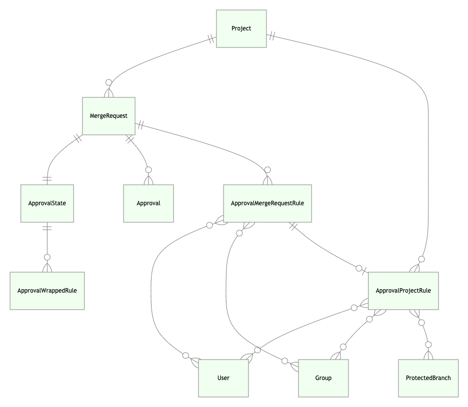

# Approval Rules **(STARTER)**

This document explains the backend design and flow of all related functionality
about merge request approval rules.

This should help contributors to understand the code design easier and to also
help see if there are parts to improve as the feature and its implementation
evolves.

It's intentional that it doesn't contain too much implementation detail as they
can change often. The code should explain those things better. The components
mentioned here are the major parts of the application for the approval rules
feature to work.

**NOTE:** This is a living document and should be updated accordingly when parts
of the codebase touched in this document changed/removed or when new components
are added.

## Data Model

Image generated using [Mermaid Live Editor](https://mermaid-js.github.io/mermaid-live-editor).



<details>
  <summary>Mermaid code</summary>

  ```
  erDiagram
    Project ||--o{ MergeRequest: " "
    Project ||--o{ ApprovalProjectRule: " "
    ApprovalProjectRule }o--o{ User: " "
    ApprovalProjectRule }o--o{ Group: " "
    ApprovalProjectRule }o--o{ ProtectedBranch: " "
    MergeRequest ||--|| ApprovalState: " "
    ApprovalState ||--o{ ApprovalWrappedRule: " "
    MergeRequest ||--o{ Approval: " "
    MergeRequest ||--o{ ApprovalMergeRequestRule: " "
    ApprovalMergeRequestRule }o--o{ User: " "
    ApprovalMergeRequestRule }o--o{ Group: " "
    ApprovalMergeRequestRule ||--o| ApprovalProjectRule: " "
  ```
</details>

### `Project` and `MergeRequest`

They are are defined in `ee/app/models/ee/project.rb` and
`ee/app/models/ee/merge_request.rb`. They extend the non-EE versions since
approval rules is an EE only feature. Associations and other related stuff to
merge request approvals are defined here.

### `ApprovalState`

It is defined in `ee/app/models/approval_state.rb`. It's not an actual
ActiveRecord model. This class encapsulates all logic related to the state
of the approvals for a certain merge request like:

- knowing the approval rules that are applicable to the merge request based on
  its target branch
- knowing the approval rules that are applicable to a certain target branch
- checking if all rules were approved
- checking if approval is required
- knowing how many approvals were given or still required

It gets the approval rules data from the project (`ApprovalProjectRule`) or the
merge request (`ApprovalMergeRequestRule`) and wrap it as `ApprovalWrappedRule`.

### `ApprovalProjectRule`

This model is defined in `ee/app/models/approval_project_rule.rb`. It has the
following attributes:

A record is created/updated/deleted when an approval rule is added/edited/removed
via project settings or the [project level approvals API](../api/merge_requests_approvals.md#project-level-mr-approvals).
The `ApprovalState` model get these records when overriding approval rules is not
enabled.

The `protected_branches` attribute is set and used when a rule is scoped to
protected branches. See [Scoped to Protected Branch doc](../user/project/merge_requests/merge_request_approvals.md#scoped-to-protected-branch-premium)
for more information about the feature.

### `ApprovalMergeRequestRule`

This is defined in `ee/app/models/approval_merge_request_rule.rb`. It's like
`ApprovalProjectRule` but this model is used instead when overridding
approval rules is enabled. A record is created/updated/deleted when an approval
is added/edited/removed via merge request create/edit form or the [merge request
level approvals API](../api/merge_requests_approvals.md#merge-request-level-mr-approvals).

The `approval_project_rule` is set when it is based from an existing project
level rule.

An `ApprovalMergeRequestRule` doesn't have `protected_branches` as it inherits
them from the `approval_project_rule` if not overridden.

### `ApprovalWrappedRule`

Defined in `ee/app/modes/approval_wrapped_rule.rb` and is not an ActiveRecord
model. It's used to wrap an `ApprovalProjectRule` or `ApprovalMergeRequestRule`
for common interface. It also has the following sub types:

- `ApprovalWrappedAnyApprovalRule` - for wrapping an `any_approver` rule
- `ApprovalWrappedCodeOwnerRule` - for wrapping a `code_owner` rule

This class delegates most of the responsibilities to the approval rule it wraps
but it's also responsible for:

- checking if the approval rule is approved
- knowing how many approvals were given or still required for the approval rule

It gets this information from the approval rule and the `Approval` records from
the merge request.

### `Approval`

This is defined in `ee/app/models/approval.rb`. This model is responsible for
storing information about an approval made on a merge request. Whenever an
approval is given/revoked, a record is created/deleted.
