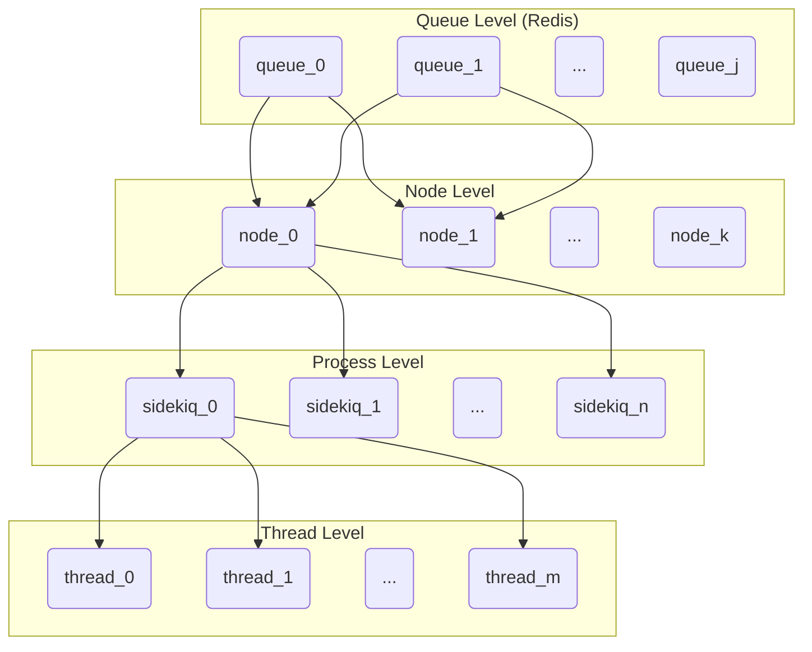

# Sidekiq debugging

GitLab uses [Sidekiq](https://github.com/mperham/sidekiq) to handle long running work loads. A good example for such a work load would be an email notification that needs to be dispatched in response to a user action. By moving these long running actions off the request/response path, we can keep latency low. This section contains a brief overview of what Sidekiq is, how it works, and how to interact with it when working on the GitLab source code.

## Sidekiq conceptually

Sidekiq is based on 3 main concepts: workers, jobs, and queues. A **worker** is a description of an application work load you want to run, such as dispatching an email, encoded as a Ruby class that mixes in the `Sidekiq::Worker` type. Unfortunately, Sidekiq isn't even internally consistent with its nomenclature(*), as it also [calls a thread executing that code a worker](https://github.com/mperham/sidekiq/wiki/API#workers). Hereafter I will use **worker** to refer to the thread running the code defined in the **worker class**. Moving on. A **job** is a request to Sidekiq for a worker to instantiate and execute the worker class. So for any one worker class, there can be many jobs executing its instances (e.g. emails sent). Jobs are posted to shared **queues**, from which Sidekiq reads and assigns jobs to the next available worker.

(*)_Unfortunately, in the language we have adopted at GitLab, the term 'worker' is usually used to refer to a particular Sidekiq process executing worker threads, so you have to look out for the specific context the term is used in._

## Sidekiq's execution model

GitLab can run Sidekiq in different modes: as a single process in `development` and multi-process (also called "clustered") in production (and as part of an Omnibus installation). Each Sidekiq process operates a thread pool, with each thread representing a worker that gets work assigned from a job. The number of threads is also referred to as the _concurrency level_ at which a Sidekiq process operates. Job queues are stored in Redis, so that the main application process(es) as well as multiple Sidekiq processes can read from and write to any given queue. This is also why job parameters _must_ be serializable, as jobs are stored in Redis as JSON.

## Sidekiq at GitLab

At GitLab we have dozens of queues; they are defined in [`config/sidekiq_queues.yml`](https://gitlab.com/gitlab-org/gitlab/blob/master/config%2Fsidekiq_queues.yml) in the main application repository. The way workers are assigned queues to process differs between the development and production environments and is further described below.

### GDK / development setup

When running GitLab locally e.g. with the GDK, Sidekiq will run by default as a single process with 10 worker threads. We can see this when running `gdk start redis rails-background-jobs` to bring up redis and Sidekiq (assuming `runit` is used for process management) and running `pstree -atp`:

```
...
  │   │   ├─runsv,1471 rails-background-jobs
  │   │   │   ├─bundle,14559
  │   │   │   │   ├─{base_reliable_*},14627
  │   │   │   │   ├─{connection_poo*},14568
  │   │   │   │   ├─{connection_poo*},14628
  │   │   │   │   ├─{daemon.rb:38},14618
  │   │   │   │   ├─{daemon.rb:38},14640
  │   │   │   │   ├─{util.rb:23},14792
  │   │   │   │   ├─{util.rb:23},14793
  │   │   │   │   ├─{util.rb:23},14794
  │   │   │   │   ├─{util.rb:23},14795
  │   │   │   │   ├─{util.rb:23},14796
...
```

`runsv` is the process supervisor for a service called `rails-background-job`. That service will run a GDK script called `sv/rails-background-jobs/run`, which in return runs `gitlab/bin/background_jobs`, which in turn runs `bundle exec sidekiq`. That's why the process name here is `bundle`, not `sidekiq` (although `ps` will list the process as `sidekiq`) The elements underneath that node wrapped in curly braces `{...}` are threads.

Since there is only one process, all jobs from all queues are being processed by all workers executed by that process.

### Production / Omnibus

For `*.gitlab.com` and for self-managed installations (both of which are deployed from Omnibus packages), Sidekiq runs in **clustered** i.e. multi-process mode. What this does is spin up several Sidekiq processes per server node, each of which then runs its own thread pool. For gitlab.com, we also have multiple **instances** i.e. server nodes (using Google Compute Engine), each running their own cluster of Sidekiq processes. This is illustrated in the diagram below.



In this example we have `K` server nodes, two of which (`node_0` and `node_1`) are configured to process any jobs written to queues `queue_0` and `queue_1`.
Each node runs `N` Sidekiq processes, each of which in return runs `M` threads. So in total this setup can processes at most `2 * N * M` jobs from the given queues.
Connections in the diagram are only drawn for the left-most elements for better readability.

Queues are furthermore grouped into **queue groups** based on the workloads they represent.
How queues are mapped to priorities and clusters is well explained in [this issue](https://gitlab.com/gitlab-org/gitlab/issues/32258) and the related links, but to summarize:

- all Sidekiq clusters are configured with a particular **priority configuration** (i.e. scaled according to a particular work load, such as "mostly CPU bound" or "mostly I/O bound")
- each queue is then mapped to a priority configuration, either directly, or if there is no explicit mapping, to `besteffort`

These configurations and mappings are defined in [this file](https://ops.gitlab.net/gitlab-cookbooks/chef-repo/blob/master/tools/sidekiq-config/sidekiq-queue-configurations.libsonnet).

All workers within a cluster will execute any job from the queues that they read from.

### The `sidekiq-cluster` script

To implement a multi-process / clustered setup such as for the environments mentioned above we use a GitLab EE specific script that is part of the Omnibus packages: [`sidekiq-cluster`](https://gitlab.com/gitlab-org/gitlab/blob/master/ee%2Flib%2Fgitlab%2Fsidekiq_cluster.rb). It's a wrapper around Sidekiq, and its main function is to do the following:

- provide a CLI component that takes a grouped list of queues and other options as arguments
- interpret and map command line options to Sidekiq options and provide reasonable defaults
- for every queue group, do:
  - spawn `bundle exec sidekiq` with the queues for that group
  - set the concurrency level for that process to `num_queues+1`, or `max_concurrency`, whichever is smaller
  - spawn a supervisor thread that will await the child process
- enter a loop that continuously polls for all child processes to be alive, and exit if one of them dies

For instance, `$ee/bin/sidekiq-cluster a b,c` will spawn 2 Sidekiq processes (say P1 and P2) with the following settings:

P1:

- queues: `a`
- concurrency: `2`

P2:

- queues: `b`, `c`
- concurrency: `3`

### Metrics

We currently track Sidekiq metrics in prometheus in 3 different places:

1. [prometheus-app](https://prometheus-app.gprd.gitlab.net) contains `sidekiq_` metrics that are specific to application code executing in Sidekiq workers, most importantly anything we export through our [sidekiq middleware](https://gitlab.com/gitlab-org/gitlab/blob/master/lib%2Fgitlab%2Fsidekiq_middleware%2Fmetrics.rb). Anything that measure per-worker metrics or anything that would rely on the process or thread that is executing our jobs needs to go here.
1. [prometheus-main](https://prometheus.gprd.gitlab.net) contains `sidekiq_` metrics that track general infrastructure and cluster health and which have meaning outside of the application context.
1. [gitlab-exporter](https://gitlab.com/gitlab-org/gitlab-exporter) contains a Sidekiq specific endpoint that prometheus can scrape for metrics. This mostly exists for customers running self-managed environments and should not be used to expose metrics for gitlab.com.

_Note that for the staging environment of gitlab.com, metrics are available on dedicated Prometheus servers ([main](https://prometheus.gstg.gitlab.net) and [app](https://prometheus-app.gstg.gitlab.net))._

In `development` mode, all web-app metrics can be fetched from the `/-/metrics` endpoint, however, the Sidekiq middleware will not export metrics by default. You can enable it in `gitlab.yml` by enabling the `sidekiq_exporter`:

```yaml
sidekiq_exporter:
      enabled: true
      address: localhost
      port: 3807
```

Note that the endpoint for Sidekiq is `/metrics`, not `/-/metrics`.

### Log arguments to Sidekiq jobs

If you want to see what arguments are being passed to Sidekiq jobs you can set
the `SIDEKIQ_LOG_ARGUMENTS` [environment variable](https://docs.gitlab.com/omnibus/settings/environment-variables.html) to `1` (true).

Example:

```
gitlab_rails['env'] = {"SIDEKIQ_LOG_ARGUMENTS" => "1"}
```

Please note: It is not recommend to enable this setting in production because some
Sidekiq jobs (such as sending a password reset email) take secret arguments (for
example the password reset token).

When using [Sidekiq JSON logging](../administration/logs.md#sidekiqlog),
arguments logs are limited to a maximum size of 10 kilobytes of text;
any arguments after this limit will be discarded and replaced with a
single argument containing the string `"..."`.
