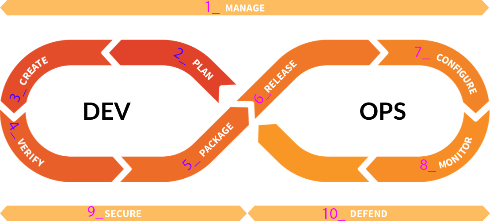

# End-to-end test writing beginner's guide

In this tutorial, you will learn about the creation of end-to-end (_e2e_) tests for GitLab CE and GitLab EE.

By the end of this tutorial, you will be able to:

- Determine whether an end-to-end test is needed
- Understand the directory structure within `qa/`
- Write a basic end-to-end test that will validate login functionality
- Develop any missing [page object](page_objects.md) libraries

## Important information before we start writing tests

You must have your [GitLab Development Kit (GDK)](https://gitlab.com/gitlab-org/gitlab-development-kit) configured to run the specs.

The end-to-end tests:

- are contained within the `qa/` directory
- should be independent and [idempotent](https://en.wikipedia.org/wiki/Idempotence#Computer_science_meaning)
- create [resources](resources.md) on an ad-hoc basis (e.g. project, issue, user)
- test the UI and API interfaces and utilize the API to efficiently set up the UI tests

TIP: **Tip:**
See [best practices](best_practices.md)

## Table of Contents

- [0.](#0-are-end-to-end-tests-needed) Are end-to-end tests needed?
- [1.](#1-identifying-the-devops-stage) Identifying the [DevOps stage](https://about.gitlab.com/stages-devops-lifecycle/) where the test will go
- [2.](#2-test-skeleton) Creating the test file
- [3.](#3-writing-the-test) Write the test
- [4.](#4-de-duplicating-code) De-duplicating code
- [5.](#5-test-setup-using-resources-and-page-objects) Test setup using [resources](resources.md) and [Page Objects](page_objects.md)
- [6.](#6-writing-the-page-object) Moving element definitions and methods to [Page Objects](page_objects.md)
- [Run your end-to-end spec](#run-the-spec)

## 0. Are end-to-end tests needed?

Is there sufficient test coverage at the unit, feature, or integration levels? If you answered *yes* then you *do not* need an end-to-end test.

Check the code coverage of a specific feature before writing end-to-end tests,
for both [CE](https://gitlab-org.gitlab.io/gitlab-foss/coverage-ruby/#_AllFiles) and [EE](https://gitlab-org.gitlab.io/gitlab/coverage-ruby/#_AllFiles) projects.

TIP: **Tip:**
See [Testing Levels](https://gitlab.com/gitlab-org/gitlab/blob/master/doc/development/testing_guide/testing_levels.md)

CAUTION: **Caution:**
Be sure to check both [CE](https://gitlab-org.gitlab.io/gitlab-foss/coverage-ruby/#_AllFiles) and [EE](https://gitlab-org.gitlab.io/gitlab/coverage-ruby/#_AllFiles)
coverage projects to see if there are already tests written for this feature.
For analyzing the code coverage, you will also need to understand which application files implement specific functionalities.
**Disclaimer**: In this particular tutorial we are writing a login end-to-end test which has already been sufficiently covered by lower-level testing.
We chose login as it is step one for most end-to-end flows and is easiest to understand.

- Take a look at the [How to test at the correct level?](https://gitlab.com/gitlab-org/gitlab/blob/master/doc/development/testing_guide/testing_levels.md#how-to-test-at-the-correct-level) section of the [Testing levels](https://gitlab.com/gitlab-org/gitlab/blob/master/doc/development/testing_guide/testing_levels.md) document.
- Review how often the feature is changed. Stable features that don't change very often might not be worth covering with end-to-end tests if they're already covered in lower levels.
- Finally, discuss the proposed test with the developer(s) involved in implementing the feature and the lower-level tests.

## 1. Identifying the DevOps stage

The GitLab QA end-to-end tests are organized by the different [stages in the DevOps lifecycle](https://gitlab.com/gitlab-org/gitlab-foss/tree/master/qa/qa/specs/features/browser_ui).



Determine where the test should be placed by [stage](https://about.gitlab.com/handbook/product/categories/#devops-stages). Then determine which feature the test will belong to and place it in a subdirectory under the stage.

NOTE: **Note:**
If the test is Enterprise Edition only, the test will be created in the `features/ee` directory but will follow the same DevOps lifecycle format.

## 2. Test skeleton

In the first part of this tutorial we will be testing login. Login is owned by Manage.

Inside `qa/specs/features/browser_ui/1_manage/login`, create a file `basic_login_spec.rb`.

### The outer `context` block

Specs have an outer `context` that indicates the DevOps stage.

```ruby
# frozen_string_literal: true

module QA
  context 'Manage' do

  end
end
```

### The `describe` block

Inside of our outer `context`, we describe the feature under test. In our case, Login.

```ruby
# frozen_string_literal: true

module QA
  context 'Manage' do
    describe 'Login' do

    end
  end
end
```

### The `it` blocks (examples)

Every test suite is composed of at least one `it` block (example). A good way to start writing end-to-end tests is by writing test case descriptions as `it` blocks.

Let's add our `it` block.

```ruby
module QA
  context 'Manage' do
    describe 'Login' do
      it 'can login' do

      end

      it 'can logout' do

      end
    end
  end
end
```

## 3. Writing the test

An important question is "What do we test?" and even more importantly, "How do we test?"

Let's start by logging in.

```ruby
# frozen_string_literal: true

module QA
  context 'Manage' do
    describe 'Login' do
      it 'can login' do
        Flow::Login.sign_in

      end

      it 'can logout' do
        Flow::Login.sign_in

      end
    end
  end
end
```

After [running the spec](#run-the-spec) our test should login and end.

Let's answer the question "What do we test?"

```ruby
# frozen_string_literal: true

module QA
  context 'Manage' do
    describe 'Login' do
      it 'can login' do
        Flow::Login.sign_in

        Page::Main::Menu.perform do |menu|
          expect(menu).to be_signed_in
        end
      end

      it 'can logout' do
        Flow::Login.sign_in

        Page::Main::Menu.perform do |menu|
          menu.sign_out

          expect(menu).not_to be_signed_in
        end
      end
    end
  end
end
```

**What do we test?**

1. Can we login?
1. Can we logout?

**How do we test?**

1. Check if the user avatar appears in the top nav
1. Check if the user avatar *does not* appear in the top nav

NOTE: **Note:**
Behind the scenes, `be_signed_in` is a [predicate matcher](https://relishapp.com/rspec/rspec-expectations/v/3-8/docs/built-in-matchers/predicate-matchers)
that [implements checking the user avatar](https://gitlab.com/gitlab-org/gitlab/-/blob/master/qa/qa/page/main/menu.rb#L74).

## 4. De-duplicating code

We should refactor our test to use a `before` block for test setup since we are duplicating a call to `sign_in`.

```ruby
# frozen_string_literal: true

module QA
  context 'Manage' do
    describe 'Login' do
      before do
        Flow::Login.sign_in
      end

      it 'can login' do
        Page::Main::Menu.perform do |menu|
          expect(menu).to be_signed_in
        end
      end

      it 'can logout' do
        Page::Main::Menu.perform do |menu|
          menu.sign_out

          expect(menu).not_to be_signed_in
        end
      end
    end
  end
end
```

The `before` block is essentially a `before(:each)` and is run before each example, which means we now sign in before each test.

## 5. Test setup using resources and page objects

Let's switch gears and test something other than Login. Let's test Issues.

Issues are owned by Plan, therefore [create a file](#1-identifying-the-devops-stage) in `qa/specs/features/browser_ui/3_create/issues` called `issues_spec.rb`.

```ruby
# frozen_string_literal: true

module QA
  context 'Plan' do
    describe 'Issues' do
      let(:issue) do
        Resource::Issue.fabricate_via_api! do |issue|
          issue.title = 'My issue'
          issue.description = 'This is an issue specific to this test'
        end
      end

      before do
        Flow::Login.sign_in
        issue.visit!
      end

      it 'can close an issue' do
        Page::Project::Issue::Show.perform do |show|
          show.click_close_issue_button

          expect(show).to be_closed
        end
      end
    end
  end
end
```

Note the following important points:

- At the start of our example we will be at the `page/issue/show.rb` [page](page_objects.md).
- Our test fabricates only what it needs, when it needs.
- The issue is fabricated via the API to save time.
- We prefer `let()` over instance variables. See [best practices](../best_practices.md#let-variables).
- `be_closed` is not implemented in `page/project/issue/show.rb` yet but will be in the next step.

The issue is fabricated as a [Resource](resources.md), which is a GitLab entity that can be created via the UI or API. Other examples include:

- A [Merge Request](https://gitlab.com/gitlab-org/gitlab/-/blob/master/qa/qa/resource/merge_request.rb)
- A [User](https://gitlab.com/gitlab-org/gitlab/-/blob/master/qa/qa/resource/user.rb)
- A [Project](https://gitlab.com/gitlab-org/gitlab/-/blob/master/qa/qa/resource/project.rb)
- A [Group](https://gitlab.com/gitlab-org/gitlab/-/blob/master/qa/qa/resource/group.rb)

## 6. Writing the page object

TIP: **Tip:**
See the [page object documentation](page_objects.md) for a more in-depth look at what Page Objects are and how to write them.

A Page Object is a class in our suite that represents a page within GitLab. The Login page would be one example.

Since our page object for the Issue Show page already exists, let's add the `closed?` method.

```ruby
module Page::Project::Issue
  class Show
    view 'app/views/projects/issues/show.html.haml' do
      element :closed_status_box
    end

    def closed?
      has_element?(:closed_status_box)
    end
  end
end
```

Let's now define the element `closed_status_box` within our view so our Page Object can see it.

```haml
-#=> app/views/projects/issues/show.html.haml
.issuable-status-box.status-box.status-box-issue-closed{ ..., data: { qa_selector: 'closed_status_box' } }
```

## Run the spec

Before running the spec, confirm:

- You have the GDK installed
- The GDK is running on port 3000 locally
- You have no additional [RSpec metadata tags](rspec_metadata_tests.md) applied
- Your working directory is `qa/` within your GDK GitLab installation

Then the command to run the spec is:

> `bundle exec bin/qa Test::Instance::All http://localhost:3000 -- <test_file>`

Where `<test_file>` is:

- `qa/specs/features/browser_ui/1_manage/login/login_spec.rb` when running the Login example
- `qa/specs/features/browser_ui/2_plan/issues/issue_spec.rb` when running the Issue example
