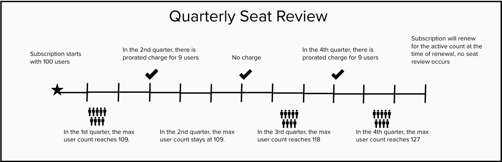
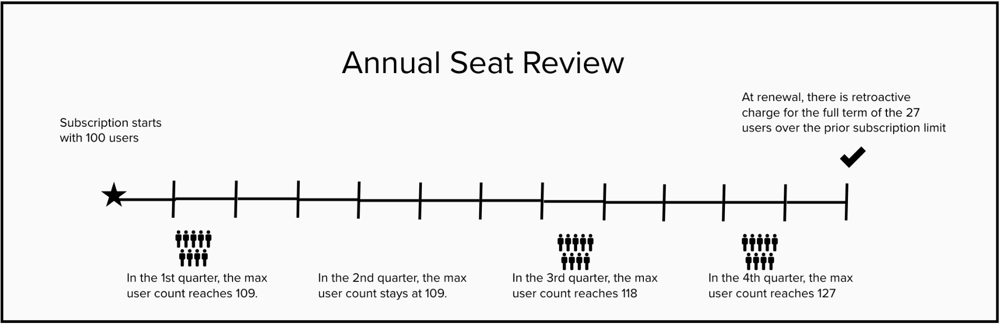

## GitLab billing policy

The intent of GitLab's billing policy is to ensure you can use our product as your team grows,
without having to stop production and negotiate contract amendments. Because of this, we allow you
to grow your user base as needed and bill you for any additional seats at our next review cycle.

For help monitoring and managing your subscription, see [GitLab subscription](index.md).

### Review cycle

Depending on the contract terms you've agreed to with us, your review cycle is either quarterly or
annual.

- Effective on 2020-06-15, new subscriptions, and existing ones upon renewal, can pay for additional
users quarterly, prorated to the end of their subscription term.
- For customers with subscriptions effective prior to 2020-06-15, the review cycle is done annually at
renewal unless otherwise stated in your Agreement.

#### Review and renewal terms

Subject to the terms of your agreement with GitLab:

- Customers signed or renewed under the Quarterly Seat Review terms will have seat usage reviewed
each quarter. You will be charged a prorated amount for the users added over your licensed amount
during the previous quarter, via the Quarterly Seat Review.
- Subscriptions created and renewed after 2020-06-15 that do not perform a Quarterly Seat Review
will pay for user overages at list price for the full term of the prior subscription via the Annual
Seat Review.
- Subscriptions created before 2020-06-15 will pay for user overages for the term of the prior
subscription at the time of renewal according to the current terms of your agreement which is
summarized in the Annual Seat Review.
- At renewal, subscriptions will be auto-renewed at their current active count, unless you have
notified us 30 days in advance of renewal to cancel.

### Quarterly seat review

For subscriptions purchased and renewed after 2020-06-15, we will either receive your usage data via
[Seat Link](index.md#seatlink), or via sales quarterly check-ins. With the data received via Seat
Link, we will automatically bill your credit card, if applicable, and send you an invoice for the
seat overage. For those customers working with our sales team due to an inability to send us data
automatically, we will send you an order amendment if there are any seat overages and subsequently
send an invoice.

#### Quarterly seat review criteria

- We measure seat utilization on the last day of the subscription quarter.
- Seat utilization is determined by the maximum number of active users within the instance at any one time over the course of the review period.
  - Active users within a self-managed GitLab instance are considered to be any user created in the
    system which has not been blocked or deactivated. This includes users who are created but have
    never logged in, users who do not have access to groups or projects, and service users like
    bots. The only exception to this is GitLab created bots (GitLab Support Bot, GitLab Alert Bot,
    etc.) and users with Guest permissions on an Ultimate subscription.
  - Active users within a GitLab.com paid namespace are considered to be any members added to the
    group or user account associated with the subscription, along with any members added to nested
    subgroups and projects within the group or user account. The only exception to this is GitLab
    created bots (GitLab Support Bot, GitLab Alert Bot, etc.) and users with Guest permissions on a
    Gold subscription.
- If your seat utilization is greater than the users in your subscription, you will be charged for
  the excess users at a prorated amount for the remaining time in your subscription and will be
  billed at list price.
- You will not be charged for an overage in the quarter the excess users were added. This seat
  review process is conducted in subscription quarters 1-3. If you have a seat overage in Q4 of your
  subscription term, you will not owe any additional fees.
- For our self-managed GitLab customers, a new license file will be sent to the contact on file
  whenever a quarterly adjustment is made.
- If a customer does not enable the automated seat link service and does not proactively report
  quarterly usage, they will be subject to the annual seat review process.

---

### Annual seat review

For customers with subscriptions purchased before 2020-06-15, or who are not sharing quarterly seat data, we will review your seat utilization at the time of renewal (or annually in the case of contract terms greater than 12 months) or as otherwise agreed to in your subscription agreement between you and GitLab. The payment of any seat overage for the prior term will be invoiced along with the renewal subscription.

#### Annual seat review criteria

- We measure seat utilization on the last day of the subscription.
- Seat utilization is determined by the maximum number of active users within the instance at any
  one time over the course of your subscription.
  - Active users within a self-managed GitLab instance are considered to be any user created in the
    system which has not been blocked or deactivated. This includes users who are created but have
    never logged in, users who do not have access to groups or projects, and service users like
    bots. The only exception to this is GitLab created bots (GitLab Support Bot, GitLab Alert Bot,
    etc.) and users with Guest permissions on an Ultimate subscription.
  - Active users within a GitLab.com paid namespace are considered to be any members added to the
    group or user account associated with the subscription, along with any members added to nested
    subgroups and projects within the group or user account.
- If your seat utilization is greater than the users in your subscription, you will be charged for
  the excess users at list price for the term of the prior subscription at the time of renewal.
- For our self-managed GitLab customers, a new license file will be sent to the contact on file at
  the time of renewal. The new license file must be [uploaded](../user/admin_area/license.md#uploading-your-license) for it to take effect.

