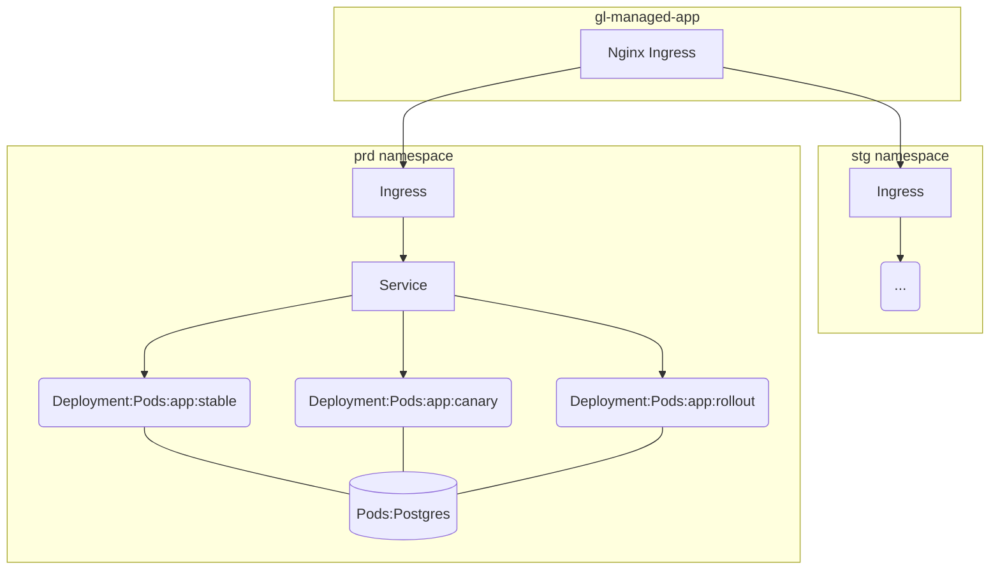
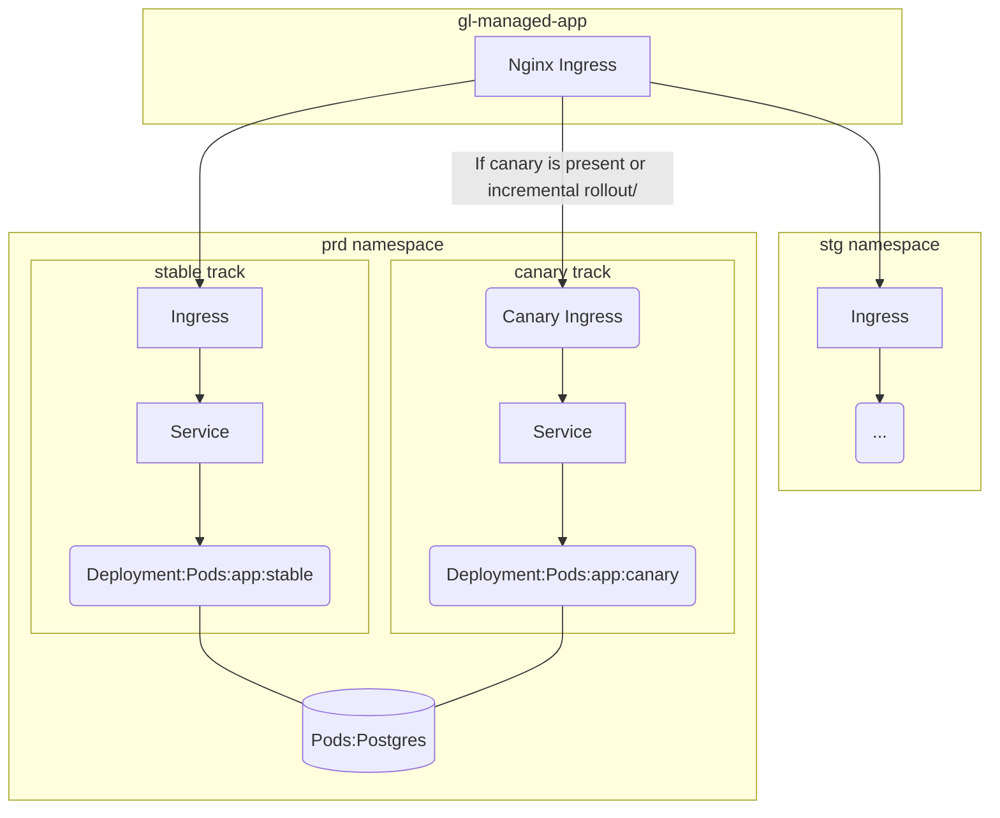

# Upgrading deployments for newer Auto Deploy dependencies (Auto Deploy template, auto-deploy-image and auto-deploy-app chart)

[Auto Deploy](stages.md#auto-deploy) is a feature to deploy your application to the Kubernetes cluster,
that consists of several dependencies:

- [Auto Deploy template](https://gitlab.com/gitlab-org/gitlab/-/blob/master/lib/gitlab/ci/templates/Jobs/Deploy.gitlab-ci.yml) ... The set of pipeline jobs and scripts that mainly leverages `auto-deploy-image`.
- [auto-deploy-image](https://gitlab.com/gitlab-org/cluster-integration/auto-deploy-image) ... The executable image that communicates with the Kubernetes cluster.
- [auto-deploy-app chart](https://gitlab.com/gitlab-org/cluster-integration/auto-deploy-image/-/tree/master/assets/auto-deploy-app) ... The Helm chart for deploying your application.

Currently, `auto-deploy-image` and `auto-deploy-app` chart are managed in [Semantic Versioning](https://semver.org/),
By default, your Auto DevOps project keeps using the stable and non-breaking version,
however, if there is a major version update in GitLab, these dependencies could contain
a breaking change that asks you to upgrade your deployments.

This guide provides instructions how to upgrade your deployments with newer and different major version of Auto Deploy dependencies.

## Before starting the upgrade process, you need to find out what dependency version your project is using

To check the current versions,

[The stable Auto Deploy template](https://gitlab.com/gitlab-org/gitlab/-/blob/master/lib/gitlab/ci/templates/Jobs/Deploy.gitlab-ci.yml) is being used, IF:

- Your Auto DevOps project doesn't have a `.gitlab-ci.yml` file, OR
- Your Auto DevOps project has a `.gitlab-ci.yml` and [includes](../../ci/yaml/README.md#includetemplate) the `Auto-DevOps.gitlab-ci.yml` template

NOTE: **Note:**
If you're on-premises user, [the stable Auto Deploy template that bundled in the GitLab package](https://gitlab.com/gitlab-org/gitlab/-/blob/master/lib/gitlab/ci/templates/Jobs/Deploy.gitlab-ci.yml) is being used.

[The latest Auto Deploy template](https://gitlab.com/gitlab-org/gitlab/-/blob/master/lib/gitlab/ci/templates/Jobs/Deploy.latest.gitlab-ci.yml) is being used, IF:

- Your Auto DevOps project has a `.gitlab-ci.yml` file and [includes](../../ci/yaml/README.md#includetemplate) the `Auto-DevOps.gitlab-ci.yml` template, AND
- It also includes [the latest Auto Deploy template](#early-adopters)

After you figured out what template is being used, take a look inside:

- `auto-deploy-image` version is described in the template (e.g. `auto-deploy-image:v1.0.3`)
- `auto-deploy-app` chart version is described [in the auto-deploy-image repository](https://gitlab.com/gitlab-org/cluster-integration/auto-deploy-image/-/blob/v1.0.3/assets/auto-deploy-app/Chart.yaml) (e.g. `version: 1.0.3`)

## Compatibility

The following table lists the version compatibility between GitLab and Auto Deploy dependencies.

| GitLab version                       | auto-deploy-image version              | Notes                                      |
|------------------                    |---------------------------             |--------------------------------------------|
| version >= v10.0 AND version < v14.0 | version >= v0.1.0 AND version < v2.0.0 | v0 and v1 auto-deploy-image are backwards compatible. |
| version >= v13.4                     | version >= v2.0.0                      | v2 auto-deploy-image contains a few breaking changes, please take a look at the [upgrade guide](#upgrade-deployments-for-v2-auto-deploy-image). |

You can find the current stable version of auto-deploy-image [in the Auto Deploy stable template](https://gitlab.com/gitlab-org/gitlab/-/blob/master/lib/gitlab/ci/templates/Jobs/Deploy.gitlab-ci.yml)

## Upgrade Guide

The Auto DevOps project must use the unmodified chart managed by GitLab.
[Customized charts](customize.md#custom-helm-chart) are unsupported.

### Upgrade deployments for v1 auto-deploy-image

The v1 chart is backward compatible with the v0 chart, so no configuration changes are needed.

### Upgrade deployments for v2 auto-deploy-image

The v2 auto-deploy-image contains multiple dependency and architectural changes.
If your Auto DevOps project has an active environment that deployed by v1 auto-deploy-image, please proceed with the following upgrade guide.
Otherwise, you can skip this process.

#### Started using Helm 3

> [Introduced](https://gitlab.com/gitlab-org/gitlab/-/issues/228609) in GitLab 13.4

auto-deploy-image uses the `helm` binary to manipulate the releases.
Previously, auto-deploy-image was using Helm v2 which requires creating Tiller in a cluster.
In v2 auto-deploy-image, it uses Helm v3 that doesn't require Tiller anymore.

**Who need to proceed with the following upgrade steps?**

- Your Auto DevOps project has an active environment that deployed by v1 auto-deploy-image.

**Upgrade steps**

1. Modify your `.gitlab-ci.yml` with the following content.

```yaml
include:
  - template: Auto-DevOps.gitlab-ci.yml
  - remote: https://gitlab.com/hfyngvason/ci-templates/-/raw/master/Helm-2to3.gitlab-ci.yml

variables:
  # If this variable is not present, the migration jobs will not show up
  MIGRATE_HELM_2TO3: "true"

.auto-deploy:
  image: registry.gitlab.com/gitlab-org/cluster-integration/auto-deploy-image:v2.0.0-beta.1
  variables:
    AUTO_DEVOPS_FORCE_DEPLOY_V2: 1
```

1. Execute `<environment-name>:helm-2to3:migrate` job.
1. Deploy your environment as usual. This deployment will use Helm 3
1. If the deployment succeeded, you can safely run `environment:helm-2to3:cleanup`. This deletes *all* Helm 2 release data from the namespace.
  * In case you accidentally delete the Helm 2 releases before you are ready, the `<environment-name>:helm2to3:migrate` job persists a backup for 1 week a job artifact called `helm-2-release-backups`. The backup is in a kubernetes manifest file and and they can be restored using `kubectl apply -f $backup`.
1. Unset the `MIGRATE_HELM_2TO3` variable

#### Traffic routing change for canary deployment and incremental rollout

> [Introduced](https://gitlab.com/gitlab-org/cluster-integration/auto-deploy-image/-/merge_requests/109) in GitLab 13.4.

Auto Deploy supports advanced deployment strategy such as [canary deployment](customize.md#deploy-policy-for-canary-environments)
and [incremental rollout](../../ci/environments/incremental_rollouts.md).
Previously, auto-deploy-image was creating one service to balance the traffic in unstable tracks and
stable track by changing the replica ratio.
In v2 auto-deploy-image, it control the traffic with [Canary Ingress](https://kubernetes.github.io/ingress-nginx/user-guide/nginx-configuration/annotations/#canary).
For more details, see the [v2 auto-deploy-app chart resource architecture](#v2-chart-resource-architecture).

**Who need to proceed the upgrade steps below?**

- Your Auto DevOps project has active `canary` or `rollout` track release in the `production` environment that deployed by v1 auto-deploy-image.

**Upgrade steps**

1. [Make sure](#which-dependency-version-is-my-project-currently-using) your project is using v1 auto-deploy-image. If not, [specify the version](#use-a-specific-version-of-auto-deploy-dependencies)
1. If you're at the middle of `canary` or `rollout` deployments, promote it to `production` at first in order to delete the unstable tracks.
1. [Make sure](#which-dependency-version-is-my-project-currently-using) your project is using v2 auto-deploy-image. If not, [specify the version](#use-a-specific-version-of-auto-deploy-dependencies)
1. Set `AUTO_DEVOPS_FORCE_DEPLOY_V2` environment variable with a value `true` in the GitLab CI.
1. Create a new pipeline and execute `production` job to renew the resource architecture with v2 auto-deploy-app chart.
1. Remove `AUTO_DEVOPS_FORCE_DEPLOY_V2` environment variable.

### Use a specific version of Auto Deploy dependencies

To use a specifc version of Auto Deploy dependencies, the most recommended way is to specify
the previous Auto Deploy stable template that [contains the desired version of `auto-deploy-image` and `auto-deploy-app` chart](#which-dependency-version-is-my-project-currently-using).

For example, if the template is bundled in GitLab v13.3, change your `.gitlab-ci.yml` to:

```yaml
include:
  - template: Auto-DevOps.gitlab-ci.yml
  - remote: https://gitlab.com/gitlab-org/gitlab/-/blob/v13.3.0-ee/lib/gitlab/ci/templates/Jobs/Deploy.gitlab-ci.yml
```

### Ignore warning and continue deploying

If you are certain that the new chart version is safe to be deployed,
you can add the `AUTO_DEVOPS_FORCE_DEPLOY_V<N>` [environment variable](customize.md#build-and-deployment)
to force the deployment to continue, where `<N>` is the major version.

For example, if you want to deploy the v2.0.0 chart on a deployment that previously
used the v0.17.0 chart, add `AUTO_DEVOPS_FORCE_DEPLOY_V2`.

## Early adopters

CAUTION: **Warning:**
Using a beta/unstable auto-deploy-image could cause an unrecoverable damage to your environments.
Please do not try it out in an important project/environment.

If you want to use the latest beta/unstable version of auto-deploy-image, you can include the _latest_ Auto Deploy template into your `.gitlab-ci.yml`.

```yaml
include:
  - template: Auto-DevOps.gitlab-ci.yml
  - remote: https://gitlab.com/gitlab-org/gitlab/-/blob/master/lib/gitlab/ci/templates/Jobs/Deploy.latest.gitlab-ci.yml
```

Next stable template renewal is planned [in GitLab v14.0 release](https://gitlab.com/gitlab-org/gitlab/-/issues/232788).

## Resource Architectures of auto-deploy-app chart

### v0 and v1 chart resource architecture



### v2 chart resource architecture



## Troubleshooting

### Major version mismatch warning

If deploying a chart that has a major version that is different from the previous one,
the new chart might not be correctly deployed. This could be due to an architectural
change. If that happens, the deployment job fails with a message similar to:

```plaintext
*************************************************************************************
                                   [WARNING]
Detected a major version difference between the the chart that is currently deploying (auto-deploy-app-v0.7.0), and the previously deployed chart (auto-deploy-app-v1.0.0).
A new major version might not be backward compatible with the current release (production). The deployment could fail or be stuck in an unrecoverable status.
...
```

To clear this error message and resume deployments, you must do one of the following:

- Manually [upgrade the chart version](#upgrade-guide).
- [Use a specific chart version](#use-a-specific-version-of-auto-deploy-dependencies).

### Error: `missing key "app.kubernetes.io/managed-by": must be set to "Helm"`

If your cluster has a deployment that deployed by v1 auto-deploy-image, you might
encounter the following error.

`Error: rendered manifests contain a resource that already exists. Unable to continue with install: Secret "production-postgresql" in namespace "<project-name>-production" exists and cannot be imported into the current release: invalid ownership metadata; label validation error: missing key "app.kubernetes.io/managed-by": must be set to "Helm"; annotation validation error: missing key "meta.helm.sh/release-name": must be set to "production-postgresql"; annotation validation error: missing key "meta.helm.sh/release-namespace": must be set to "<project-name>-production"`

This is because your previous deployment was deployed with Helm2, which is not compatible with Helm3.
To resolve the problem, please follow the [upgrade guide](#upgrade-deployments-for-v2-auto-deploy-image).
