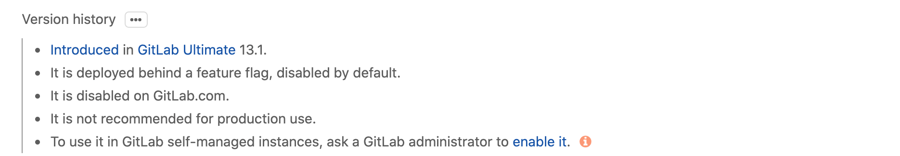

# Understand features deployed behind feature flags

GitLab adopted [feature flags strategies](../development/feature_flags/index.md)
to deploy features in an early stage of development so that they can be
incrementally rolled out.

To you, as a regular GitLab user, it means that some features added to a given
GitLab release are disabled, therefore, unavailable to you.

In this case, you'll see a warning like this in the feature documentation:

CAUTION: **Warning:**
This feature might not be available to you. Check the **version history** note
above for details.

You'll find in the version history note the information regarding the state of the feature flag, such as, whether it's enabled or disabled by default and whether it's enabled on GitLab.com. To see the full notes:

1. Click the three-dots icon to expand version history notes:

   

1. Read the version history information:

   

If you are a user of a GitLab self-managed instance and you want to try a
disabled feature, you can ask a [GitLab administrator to enable it](../administration/feature_flags.md).

If you are a user of GitLab.com and the feature is disabled, hang in there, the GitLab Team is working on enabling it. It shouldn't take long if the
feature behaves well.
