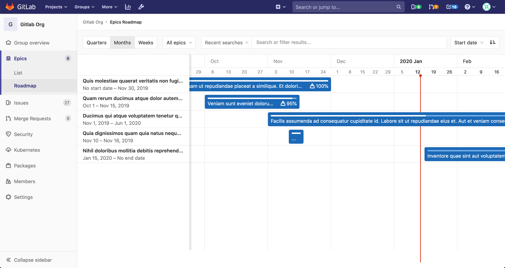

# Roadmap **(ULTIMATE)**

> Introduced in [GitLab Ultimate](https://about.gitlab.com/pricing/) 10.5.

An Epic within a group containing **Start date** and/or **Due date**
can be visualized in a form of a timeline (e.g. a Gantt chart). The Epics Roadmap page
shows such a visualization for all the epics which are under a group and/or its subgroups.

> [Introduced](https://gitlab.com/gitlab-org/gitlab/issues/5164) in GitLab 12.7.

On the epic bars, its description, progress, and completed weight percentage are shown.
When you hover over an epic bar, a popover appears with its description, start and due dates,
and weight completed.

A dropdown allows you to show only open or closed epics. By default, all epics are shown.

Epics in the view can be sorted by:

- **Created date**
- **Last updated**
- **Start date**
- **Due date**

Each option contains a button that toggles the sort order between **ascending** and **descending**. The sort option and order will be persisted when browsing Epics,
including the [epics list view](../epics/index.md).

Roadmaps can also be [visualized inside an epic](../epics/index.md#roadmap-in-epics).

## Timeline duration

> Introduced in [GitLab Ultimate](https://about.gitlab.com/pricing/) 11.0.

Roadmap supports the following date ranges:

- Quarters
- Months (Default)
- Weeks

### Quarters

In _Quarters_ preset, roadmap shows epics which have start or due dates _falling within_ or
_going through_ **past quarter**, **current quarter** and **next 4 quarters**, where _today_
is shown by the vertical red line in the timeline. The sub-headers underneath the quarter name on
the timeline header represent the month of the quarter.

### Months

In _Months_ preset, roadmap shows epics which have start or due dates _falling within_ or
_going through_ **past month**, **current month** and **next 5 months**, where _today_
is shown by the vertical red line in the timeline. The sub-headers underneath the month name on
the timeline header represent the date on starting day (Sunday) of the week. This preset is
selected by default.

### Weeks

In _Weeks_ preset, roadmap shows epics which have start or due dates _falling within_ or
_going through_ **past week**, **current week** and **next 4 weeks**, where _today_
is shown by the vertical red line in the timeline. The sub-headers underneath the week name on
the timeline header represent the days of the week.

## Timeline bar for an epic

The timeline bar indicates the approximate position of an epic based on its start
and due date. If an epic doesn't have a due date, the timeline bar has a vertical line to its right.
Similarly, if an epic doesn't have a start date, the timeline bar has a vertical line to its left.

<!-- ## Troubleshooting

Include any troubleshooting steps that you can foresee. If you know beforehand what issues
one might have when setting this up, or when something is changed, or on upgrading, it's
important to describe those, too. Think of things that may go wrong and include them here.
This is important to minimize requests for support, and to avoid doc comments with
questions that you know someone might ask.

Each scenario can be a third-level heading, e.g. `### Getting error message X`.
If you have none to add when creating a doc, leave this section in place
but commented out to help encourage others to add to it in the future. -->
