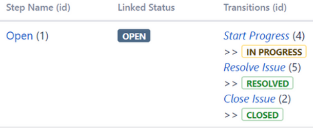

# GitLab Jira Integration

GitLab Issues are a powerful tool for collaboratively planning and tracking work. 
Some organizations use Jira for these functions while also using GitLab for other functionality, like managing code. 

If you do not choose to migrate Jira issues to GitLab entirely, GitLab's Jira Integration can be added to your projects, enabling engineers to collaborate efficiently across systems.

## Integration

Integration of GitLab and Jira enables the following features:

- Mention of a Jira issue's ID in a GitLab commit or merge request results in a link to the issue.
- Jira issue comments can be added using a Git commit.
- A Jira issue can be closed using a Git commit.

For more details, see [integration features](#integration-features).

## Integration methods

There are two options for integrating GitLab and Jira:

- GitLab Project Services
- Jira development panel

GitLab Project Services enables you to link Git commits and merge requests to Jira issues. The Jira development panel is shown on the Jira View Issue screen and provides links to the relevant commits, branches, and merge requests. Each method can be used alone, or they can be used together.

| Compatibility | GitLab.com | Self-hosted GitLab |
|:--------------|:-----------|:-------------------|
| Jira Server   | ✓          | ✓                  |
| Jira Cloud    | ✓          | ✓                  |

## Integration features

The GitLab and Jira integration options can be used simultaneously. Before deciding which integration option to implement, it's important to understand the features of each.

| Feature                                                 | GitLab Project Services | Jira development panel |
|:--------------------------------------------------------|:------------------------|:-----------------------|
| One GitLab project connects to a Jira instance          | ✓                       |                        |
| All GitLab projects connect to a Jira instance          |                         | ✓                      |
| Cross-reference GitLab commits and MRs with Jira issues | ✓                       | ✓                      |
| Add comments to Jira issues with Git commits            | ✓                       | ✓                      |
| Close a Jira issue with a Git commit                    | ✓                       | ✓                      |
| Transition a Jira issue with a Git commit               |                         | ✓                      |
| Record time tracking information against an issue       |                         | ✓                      |

For a video demonstration of integration with Jira, watch [GitLab workflow with Jira issues and Jenkins pipelines](https://youtu.be/Jn-_fyra7xQ).

## Enabling integration

To enable integration of GitLab and Jira, you need:

- Administrator access to Jira
- Administrator access to GitLab

NOTE: **Note:**
- Only Jira versions `v6.x` and `v7.x.` are supported.
- GitLab 7.8 or higher is required.
- For GitLab 8.13 and earlier, you must follow [alternate instructions][jira-repo-old-docs].
- To support Oracle's Access Manager, GitLab will send additional cookies to enable Basic Auth. The cookie being added to each request is `OBBasicAuth` with a value of `fromDialog`.

### Enabling GitLab's Project Services integration with Jira

To enable GitLab's Project Services integration with Jira, complete the following tasks:

1. [Create Jira user and grant access](jira_create_user.md).
1. [Create Jira access token](#creating-jira-access-token).
1. [Enable GitLab access to Jira](#enabling-gitlabs-access-to-jira).
1. Configuring Jira.
1. Configuring GitLab Project Services.

### Enabling the Jira development panel integration with GitLab

To enable the Jira development panel integration with GitLab, complete the following tasks:

1. [Create Jira user and grant access](jira_create_user.md).
1. [Create Jira access token](#creating-jira-access-token).
1. [Obtain Jira transition IDs](#obtaining-jira-transition-ids)
1. Enable Jira access to GitLab.
1. Configure the Jira development panel.
1. Configure GitLab.

#### Creating Jira access token

> Atlassian [deprecated](https://developer.atlassian.com/cloud/jira/platform/deprecation-notice-basic-auth-and-cookie-based-auth/) basic API authentication from June 3, 2019. Access to Jira via the API requires use of an access token. Each token is unique to each Atlassian account.

Create an Atlassian API token for the user created in [Create Jira user and grant access](jira_create_user.md). For details, see [API tokens](https://confluence.atlassian.com/cloud/api-tokens-938839638.html).

NOTE: **Note:**
Record the value of the API token. It is not possible to view the token's value after creating it. GitLab recommends not storing the API token's value because doing so is a security risk. You can create a new token and provide that to GitLab if required.


#### Obtaining Jira transition IDs

NOTE: **Note:**


A Jira workflow defines the statuses an issue may be in, and the transitions between them. For example, changing a Jira issue from **OPEN** to **CLOSED** is a transition. Transition IDs are specific to each workflow. For more details, see Atlassian's [Working with workflows](https://confluence.atlassian.com/adminjiracloud/working-with-workflows-776636540.html). In order to transition a Jira issue to closed from a GitLab commit, you need to know the relevant transition IDs.

1. Log in to your Jira instance as an administrator.

1. Go to **Administration** (gear icon) **> Projects** and select the relevant project.

1. Click **Workflows** on the left of the **Project Summary** page then click **View**.

1. Click **Edit** (pencil icon).

1. Note the desired transition IDs.

   1. In each **Step Name** row, find the **CLOSED** badge in the **Transitions** column.
   1. Note the transition ID of the transition immediately above the **CLOSED** badge.

   In the following example, to transition an issue from **OPEN** to **CLOSED** requires the _Close Issue_ transition, which has an ID of `2`.

   

#### Enabling GitLab access to Jira

> NOTE: **Note:**
>
> - This procedure can only be completed by a Jira administrator.


Complete the following procedure, depending on which product you're using:

- [Enable access to Jira Server](jira_server_configuration.md).
- [Enable access to Jira Cloud](jira_cloud_configuration.md).

#### Configuring Jira


#### Requirements

Each GitLab project can be configured to connect to an entire Jira instance. That means one GitLab project can interact with _all_ Jira projects in that instance. If you have one Jira instance, you can pre-fill the settings page with a default
template. See the [Services Templates][services-templates] docs.

In order to enable the Jira service in GitLab, you need to first configure the project in Jira and then enter the correct values in GitLab.

---

Once you integrate your GitLab project with your Jira instance, you can automatically
detect and cross-reference activity between the GitLab project and any of your projects
in Jira. This includes the ability to close or transition Jira issues when the work
is completed in GitLab.

## Configuration

Each GitLab project can be configured to connect to an entire Jira instance. That
means one GitLab project can interact with _all_ Jira projects in that instance, once
configured. Therefore, you will not have to explicitly associate
a GitLab project with any single Jira project.

If you have one Jira instance, you can pre-fill the settings page with a default
template. See the [Services Templates][services-templates] docs.

In order to enable the Jira service in GitLab, you need to first configure the project in Jira and then enter the correct values in GitLab.

### Configuring Jira

#### Jira Server

When connecting to **Jira Server**, which supports basic authentication, a **username and password** are required. Note that connecting to a Jira server via CAS is not possible. [Set up a user in Jira Server](jira_server_configuration.md) first and then proceed to [Configuring GitLab](#configuring-gitlab).

#### Jira Cloud

When connecting to **Jira Cloud**, which supports authentication via API token, an **email and API token**, are required. [Set up a user in Jira Cloud](jira_cloud_configuration.md) first and then proceed to [Configuring GitLab](#configuring-gitlab).

### Configuring GitLab

To enable the Jira integration in a project, navigate to the
[Integrations page](project_services.md#accessing-the-project-services), click
the **Jira** service, and fill in the required details on the page as described
in the table below.

| Field | Description |
| ----- | ----------- |
| `Web URL` | The base URL to the Jira instance web interface which is being linked to this GitLab project. E.g., `https://Jira.example.com`. |
| `Jira API URL` | The base URL to the Jira instance API. Web URL value will be used if not set. E.g., `https://jira-api.example.com`. |
| `Username/Email` | Created when [configuring Jira step](#configuring-jira). Use `username` for **Jira Server** or `email` for **Jira Cloud**. |
| `Password/API token` |Created in [configuring Jira step](#configuring-jira). Use `password` for **Jira Server** or `API token` for **Jira Cloud**. |
| `Transition ID` | This is the ID of a transition that moves issues to the desired state. It is possible to insert transition ids separated by `,` or `;` which means the issue will be moved to each state after another using the given order.  **Closing Jira issues via commits or Merge Requests won't work if you don't set the ID correctly.** |

### Obtaining a transition ID

In the most recent Jira user interface, you can no longer see transition IDs in the workflow
administration UI. You can get the ID you need in either of the following ways:

1. By using the API, with a request like `https://yourcompany.atlassian.net/rest/api/2/issue/ISSUE-123/transitions`
   using an issue that is in the appropriate "open" state
1. By mousing over the link for the transition you want and looking for the
   "action" parameter in the URL

Note that the transition ID may vary between workflows (e.g., bug vs. story),
even if the status you are changing to is the same.

After saving the configuration, your GitLab project will be able to interact
with all Jira projects in your Jira instance and you'll see the Jira link on the GitLab project pages that takes you to the appropriate Jira project.


## Jira issues

By now you should have [configured Jira](#configuring-jira) and enabled the
[Jira service in GitLab](#configuring-gitlab). If everything is set up correctly
you should be able to reference and close Jira issues by just mentioning their
ID in GitLab commits and merge requests.

### Referencing Jira Issues

When GitLab project has Jira issue tracker configured and enabled, mentioning
Jira issue in GitLab will automatically add a comment in Jira issue with the
link back to GitLab. This means that in comments in merge requests and commits
referencing an issue, e.g., `PROJECT-7`, will add a comment in Jira issue in the
format:

```
USER mentioned this issue in RESOURCE_NAME of [PROJECT_NAME|LINK_TO_COMMENT]:
ENTITY_TITLE
```

- `USER` A user that mentioned the issue. This is the link to the user profile in GitLab.
- `LINK_TO_THE_COMMENT` Link to the origin of mention with a name of the entity where Jira issue was mentioned.
- `RESOURCE_NAME` Kind of resource which referenced the issue. Can be a commit or merge request.
- `PROJECT_NAME` GitLab project name.
- `ENTITY_TITLE` Merge request title or commit message first line.


For example, the following commit will reference the Jira issue with `PROJECT-1` as its ID:

```bash
git commit -m "PROJECT-1 Fix spelling and grammar"
```

### Closing Jira Issues

Jira issues can be closed directly from GitLab by using trigger words in
commits and merge requests. When a commit which contains the trigger word
followed by the Jira issue ID in the commit message is pushed, GitLab will
add a comment in the mentioned Jira issue and immediately close it (provided
the transition ID was set up correctly).

There are currently three trigger words, and you can use either one to achieve
the same goal:

- `Resolves PROJECT-1`
- `Closes PROJECT-1`
- `Fixes PROJECT-1`

where `PROJECT-1` is the ID of the Jira issue.

> **Notes:**
>
> - Only commits and merges into the project's default branch (usually **master**) will
>   close an issue in Jira. You can change your projects default branch under
>   [project settings](img/jira_project_settings.png).
> - The Jira issue will not be transitioned if it has a resolution.

### Jira issue closing example

Let's consider the following example:

1. For the project named `PROJECT` in Jira, we implemented a new feature
   and created a merge request in GitLab.
1. This feature was requested in Jira issue `PROJECT-7` and the merge request
   in GitLab contains the improvement
1. In the merge request description we use the issue closing trigger
   `Closes PROJECT-7`.
1. Once the merge request is merged, the Jira issue will be automatically closed
   with a comment and an associated link to the commit that resolved the issue.

In the following screenshot you can see what the link references to the Jira
issue look like.


Once this merge request is merged, the Jira issue will be automatically closed
with a link to the commit that resolved the issue.


## Troubleshooting

If these features do not work as expected, it is likely due to a problem with the way the integration settings were configured.

### GitLab is unable to comment on a Jira issue

Make sure that the Jira user you set up for the integration has the
correct access permission to post comments on a Jira issue and also to transition
the issue, if you'd like GitLab to also be able to do so.
Jira issue references and update comments will not work if the GitLab issue tracker is disabled.

### GitLab is unable to close a Jira issue

Make sure the `Transition ID` you set within the Jira settings matches the one
your project needs to close an issue.

Make sure that the Jira issue is not already marked as resolved; that is,
the Jira issue resolution field is not set. (It should not be struck through in
Jira lists.)

### CAPTCHA

CAPTCHA may be triggered after several consecutive failed login attempts
which may lead to a `401 unauthorized` error when testing your Jira integration.
If CAPTCHA has been triggered, you will not be able to use Jira's REST API to
authenticate with the Jira site. You will need to log in to your Jira instance
and complete the CAPTCHA.

[services-templates]: services_templates.md
[jira-repo-old-docs]: https://gitlab.com/gitlab-org/gitlab-ce/blob/8-13-stable/doc/project_services/jira.md
