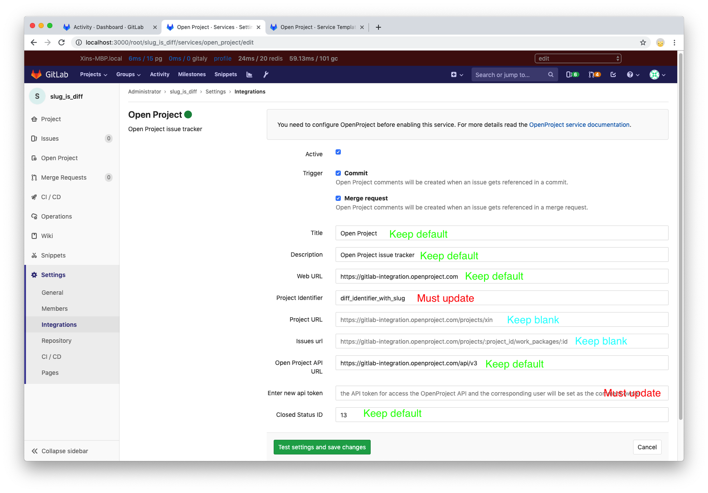

# GitLab OpenProject integration  
  
[OpenProject](https://www.openproject.org/) is the leading open source project management software which is also an open source JIRA alternative.
  
While you can always migrate content and process from GitLab to OpenProject [Work Packages](https://www.openproject.org/help/work-packages/) (similar with issues), you can also opt to continue using OpenProject and use it together with GitLab through our integration.  

## Introduction 

Once you integrate your GitLab project with your OpenProject instance, you can automatically detect and cross-reference activity between the GitLab project and any of your projects in OpenProject. This includes the ability to close OpenProject Work Packages when the work is completed in GitLab. 
  
Here's how the integration responds when you take the following actions in GitLab:  
  
- **Mention a OpenProject Work Package ID** in a commit message or MR (merge request).  
  - GitLab hyperlinks to the OpenProject Work Package. 
  - The OpenProject Work Package adds a comment reflecting the comment made in GitLab, the comment author, and a link to the commit/MR in GitLab.  
- **Mention that a commit or MR 'closes', 'resolves', or 'fixes' a OpenProject Work Package ID**. When the commit is made on master or the change is merged to master:  
  - GitLab's merge request page displays a note that it "Closed" the OpenProject Work Package ID, with a link to the issue. (Note: Before the merge, an MR will display that it "Closes" the OpenProject Work Package.)  
  - The OpenProject Work Package shows the activity and the OpenProject Work Package is closed.

### Project and issue organization

The OpenProject provides a [HAL+JSON style API](https://docs.openproject.org/apiv3-doc/), so it supports nearly all necessary API operations. The OpenProject integration provides similar functionality to JIRA, although there are several differences between them (mainly the projects and issues organisation). The issue in the OpenProject world is called work package. OpenProject also has projects, and work packages are children of projects. 

The unique identity of an issue in JIRA is the **[short code of project]-ID**, where `ID` automatically increments from 1 per project. For example, if a JIRA project is called Demo whose short code is  `demo`, the issues under the demo project will be named `DEMO-1`, `DEMO-2`, etc. So, given an issue id, we can uniquely locate the page of the issue. 

On the other hand, in OpenProject, the Work Package ID is global, which means that the ID increments from 1 in the whole OpenProject instance. In theory, with a given ID, we can find the unique Work Package page, but the URL of the Work Package will still be included in the project code and the code in the middle of the URL path.


Therefore, in this OpenProject Integration, we still use JIRA style ID: **[Project Identifier]-ID**, but when we navigate to Work Package in GitLab by the Issue ID, we need to separate the Project Identifier and ID and then re-build the Work Package URL.

Base on this design, let us think about another problem: **How to configure the integration globally and apply to multiple projects?**

1. the Work Package url has no problem, because we can use [Project Identifier-ID] as the issue ID in the commit message or Merge Request message. So the project code can be extracted from then issue id.
2. How to apply one configuration of the project URL for multiple project? The current idea is that set the Open Project Project Identifier which same as the GitLab Project Slug as default. Certainly, user can configure the Project Identifier per project.

## Configuration

Each GitLab project can be configured to connect to an entire OpenProject instance (because of the organization of the Project and Work Package). That means one GitLab project can interact with _all_ OpenProject projects in that instance, once configured. Therefore, you will not have to explicitly associate a GitLab project with any single OpenProject project. However if you want the Project URL in every GitLab project can link to the exact the OpenProject project, you have two choices: 

1. Unify the name of **GitLab Project Slug** and **OpenProject Project Identifier** with same string. This string should not contain dash `-` which will break the external issue cross reference. 

GitLab Project Slug configuration:


OpenProject Project Identifier configuration:


2. Set the Project URL or the Project Identifier per project which will be used in the following order: Project URL  > Project Identifier > use GitLab Project Slug as the OpenProject Identifier.

If you have one OpenProject instance, you can pre-fill the settings page with a default template. See the [Services Templates](services_templates.md) docs. And update the configuration per project separately.

### Configuring OpenProject

The cloud version of OpenProject is the same with the self-hosted version, so there's no difference between them.

There are several things that need to be configured on the OpenProject.

#### Create a GitLab bot user

In theory you can use any user with enough permissions to operate on the entire OpenProject instance, however, if you create a separate account whose name is GitLab Bot, all the cross reference comments will created by this user. So, everything will be clear and users won't be confused.


Once you set up the GitLab Bot user in OpenProject, it is recommended to add the official GitLab logo as its avatar. 

You can find the official GitLab logos in the [press kit page](https://about.gitlab.com/press/press-kit/).


#### Generate an API Key

This step is necessary, since the API key will be used to integrate Work Packages with GitLab. Copy the key and save it to safe place, we'll use it later.


### Configuring GitLab

To enable OpenProject integration in a project, navigate to the [Integrations page](project_services.md#accessing-the-project-services), click the **Open Project** service, and fill in the required details on the page as described in the table below.

| Field | Description |
| ----- | ----------- |
| `Web URL` |  The base URL to the OpenProject instance web interface which is being linked to this GitLab project. E.g., `https://gitlab-integration.openproject.com`. This is required.|
| `Project Identifier` | The unique identifier string of project in the OpenProject instance. It will be used to construct the exact project URL link. This is optional and the default is the GitLab Project Slug. E.g., `demo`. |
| `Project URL` | The base URL to the OpenProject  project which is being linked to this GitLab project. This is optional and the default value is based on v8.0 rule: `{WEB URL}/projects/{Project Identifier}`. E.g., `https://gitlab-integration.openproject.com/projects/project_identifier`. |
| `API URL` | The base URL to the OpenProject instance API. This is required and the default value is based on Web URL with [Official Doc](https://docs.openproject.org/apiv3-doc/). E.g., `https://gitlab-integration.openproject.com/api/v3/` |
| `API token` | Created in [Generate API Key](#generate-an-api-key). Same for both cloud and self-hosted OpenProject instances. This is required.|
| `Closed Status ID` | The ID of closed status on OpenProject instance. This is required and the default value is `13` which is OpenProject original closed status ID.|
| `Issue URL` | The Issue URL is a link to external OpenProject Work Package. This is optional and the default value is based on v8.0 rule: `{WEB URL}/projects/:project_id/work_packages/:id`. E.g., `https://gitlab-integration.openproject.com/projects/:project_id/work_packages/:id` |

### Referencing an OpenProject work package

When your GitLab project has the OpenProject issue tracker configured and enabled, mentioning an OpenProject issue in GitLab will automatically add a comment in the OpenProject work package with the link back to GitLab. This means that in comments in merge requests and commits referencing an issue, e.g., `PROJECT-7`, will add a comment in the work package in the following format:

```
USER mentioned this issue in RESOURCE_NAME of [PROJECT_NAME|LINK_TO_COMMENT]:
ENTITY_TITLE
```

- `USER` - The user that mentioned the issue. This is the link to the user profile in GitLab.
- `LINK_TO_THE_COMMENT` - Link to the origin of mention with a name of the entity where the OpenProject issue was mentioned.
- `RESOURCE_NAME` - The kind of resource which referenced the issue. Can be a commit or merge request.
- `PROJECT_NAME` - The GitLab project name.
- `ENTITY_TITLE` - The first line of the merge request title or commit message.


If you use `API Token` of different OpenProject Users to authorized the GitLab to create the comment, the `Arthur` of the comment will be different:


### Closing an OpenProject work package
  
OpenProject work packages can be closed directly from GitLab by using trigger words in commits and merge requests. When a commit which contains the trigger word followed by the OpenProject issue ID in the commit message is pushed, GitLab will add a comment in the mentioned OpenProject issue and immediately close it (provided the transition ID was set up correctly).  
  
  
  
There are currently three trigger words, and you can use either one to achieve the same goal:  
  
- `Resolves PROJECT-1`  
- `Closes PROJECT-1`  
- `Fixes PROJECT-1`  
  
Where `PROJECT-1` is the issue ID of the OpenProject project.  

TIP: **Tip:**
The closed statuses can be configured by the `Closed Status ID`, since OpenProject supports adding your own custom status. As of OpenProject v8, the default ID of Closed Status is `13`.

 

### Best practice

This part of document will give a best practice to configure the OpenProject Integration on GitLab.

#### Set up the Service Template of OpenProject instance

1. Title: **Keep default** or change to any name you want. It will be displayed in GitLab Project sidebar globally.
2. Description: **Keep blank**.
3. Web URL: **Must update** based on your OpenProject instance.
4. Project Identifier: **Keep blank**.
5. Project URL: **Keep blank**.
6. Issues URL: **Keep blank**.
7. OpenProject API URL: **Keep blank**.
8. API token: **Must update** based on your OpenProject instance and user.
9. Closed Status ID: **Keep default** or change to any status id you want.


### Set up the project on GitLab and OpenProject

Unify the **GitLab Project Slug** and **OpenProject Project Identifier** as far as possible. If they are unified, you need not to set up the OpenProject Integration on the GitLab Project separately.

If the **GitLab Project Slug** is different with the **OpenProject Project Identifier**, you need to configure this GitLab Project separately as follow:

1. Title: **Keep default** or change to any name you want. It will be displayed in GitLab Project sidebar globally.
2. Description: **Keep default**.
3. Web URL: **Keep default**.
4. Project Identifier: **Must update** to corresponding OpenProject Project Identifier.
5. Project URL: **Keep blank**.
6. Issues URL: **Keep blank**.
7. Open Project API URL: **Keep default**.
8. API token: **Must update** based on your OpenProject instance and user.
9. Closed Status ID: **Keep default**.



## Troubleshooting

### Project Identifier

The OpenProject Identifier should NOT include any `dash`(`-`) even though the OpenProject support `dash`(`-`) in the project identifier.

> **Notes:**  
> - Only commits and merges into the project's default branch (usually **master**) will  
> close an issue in OpenProject. You can change your projects default branch under  
> [project settings](img/jira_project_settings.png). 