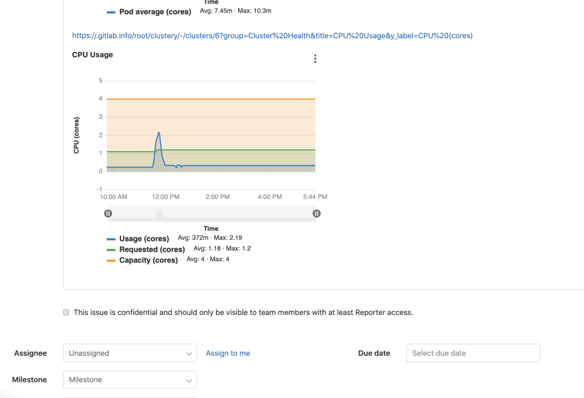

# Prometheus integration

> [Introduced](https://gitlab.com/gitlab-org/gitlab-foss/-/merge_requests/8935) in GitLab 9.0.

GitLab offers powerful integration with [Prometheus](https://prometheus.io) for monitoring key metrics of your apps, directly within GitLab.
Metrics for each environment are retrieved from Prometheus, and then displayed
within the GitLab interface.


There are two ways to set up Prometheus integration, depending on where your apps are running:

- For deployments on Kubernetes, GitLab can automatically [deploy and manage Prometheus](#managed-prometheus-on-kubernetes).
- For other deployment targets, simply [specify the Prometheus server](#manual-configuration-of-prometheus).

Once enabled, GitLab will automatically detect metrics from known services in the [metric library](#monitoring-cicd-environments). You can also [add your own metrics](#adding-custom-metrics).

## Enabling Prometheus Integration

### Managed Prometheus on Kubernetes

> [Introduced](https://gitlab.com/gitlab-org/gitlab-foss/issues/28916) in GitLab 10.5.

GitLab can seamlessly deploy and manage Prometheus on a [connected Kubernetes cluster](../clusters/index.md), making monitoring of your apps easy.

#### Requirements

- A [connected Kubernetes cluster](../clusters/index.md)
- Helm Tiller [installed by GitLab](../clusters/index.md#installing-applications)

#### Getting started

Once you have a connected Kubernetes cluster with Helm installed, deploying a managed Prometheus is as easy as a single click.

1. Go to the **Operations > Kubernetes** page to view your connected clusters
1. Select the cluster you would like to deploy Prometheus to
1. Click the **Install** button to deploy Prometheus to the cluster


#### Getting metrics to display on the Metrics Dashboard

After completing the steps above, you will also need deployments in order to view the
**Operations > Metrics** page. Setting up [Auto DevOps](../../../topics/autodevops/index.md)
will help you to quickly create a deployment:

1. Navigate to your project's **Operations > Kubernetes** page, and ensure that,
   in addition to "Prometheus" and "Helm Tiller", you also have "Runner" and "Ingress"
   installed. Once "Ingress" is installed, copy its endpoint.
1. Navigate to your project's **Settings > CI/CD** page. In the Auto DevOps section,
   select a deployment strategy and save your changes.
1. On the same page, in the Variables section, add a variable named `KUBE_INGRESS_BASE_DOMAIN`
   with the value of the Ingress endpoint you have copied in the previous step. Leave the type
   as "Variable".
1. Navigate to your project's **CI/CD > Pipelines** page, and run a pipeline on any branch.
1. When the pipeline has run successfully, graphs will be available on the **Operations > Metrics** page.


#### Using the Metrics Dashboard

##### Select an environment

The **Environment** dropdown box above the dashboard displays the list of all [environments](#monitoring-cicd-environments).
It enables you to search as you type through all environments and select the one you're looking for.


#### About managed Prometheus deployments

Prometheus is deployed into the `gitlab-managed-apps` namespace, using the [official Helm chart](https://github.com/helm/charts/tree/master/stable/prometheus). Prometheus is only accessible within the cluster, with GitLab communicating through the [Kubernetes API](https://kubernetes.io/docs/concepts/overview/kubernetes-api/).

The Prometheus server will [automatically detect and monitor](https://prometheus.io/docs/prometheus/latest/configuration/configuration/#kubernetes_sd_config) nodes, pods, and endpoints. To configure a resource to be monitored by Prometheus, simply set the following [Kubernetes annotations](https://kubernetes.io/docs/concepts/overview/working-with-objects/annotations/):

- `prometheus.io/scrape` to `true` to enable monitoring of the resource.
- `prometheus.io/port` to define the port of the metrics endpoint.
- `prometheus.io/path` to define the path of the metrics endpoint. Defaults to `/metrics`.

CPU and Memory consumption is monitored, but requires [naming conventions](prometheus_library/kubernetes.md#specifying-the-environment) in order to determine the environment. If you are using [Auto DevOps](../../../topics/autodevops/index.md), this is handled automatically.

The [NGINX Ingress](../clusters/index.md#installing-applications) that is deployed by GitLab to clusters, is automatically annotated for monitoring providing key response metrics: latency, throughput, and error rates.

### Manual configuration of Prometheus

#### Requirements

Integration with Prometheus requires the following:

1. GitLab 9.0 or higher
1. Prometheus must be configured to collect one of the [supported metrics](prometheus_library/index.md)
1. Each metric must be have a label to indicate the environment
1. GitLab must have network connectivity to the Prometheus server

#### Getting started

Installing and configuring Prometheus to monitor applications is fairly straightforward.

1. [Install Prometheus](https://prometheus.io/docs/prometheus/latest/installation/)
1. Set up one of the [supported monitoring targets](prometheus_library/index.md)
1. Configure the Prometheus server to [collect their metrics](https://prometheus.io/docs/prometheus/latest/configuration/configuration/#scrape_config)

#### Configuration in GitLab

The actual configuration of Prometheus integration within GitLab is very simple.
All you will need is the domain name or IP address of the Prometheus server you'd like
to integrate with.

1. Navigate to the [Integrations page](overview.md#accessing-integrations).
1. Click the **Prometheus** service.
1. Provide the domain name or IP address of your server, for example `http://prometheus.example.com/` or `http://192.0.2.1/`.
1. Click **Save changes**.


#### Thanos configuration in GitLab

You can configure [Thanos](https://thanos.io/) as a drop-in replacement for Prometheus
with GitLab. You will need the domain name or IP address of the Thanos server you'd like
to integrate with.

1. Navigate to the [Integrations page](overview.md#accessing-integrations).
1. Click the **Prometheus** service.
1. Provide the domain name or IP address of your server, for example `http://thanos.example.com/` or `http://192.0.2.1/`.
1. Click **Save changes**.

### Precedence with multiple Prometheus configurations

Although you can enable both a [manual configuration](#manual-configuration-of-prometheus)
and [auto configuration](#managed-prometheus-on-kubernetes) of Prometheus, only
one of them will be used:

- If you have enabled a
  [Prometheus manual configuration](#manual-configuration-of-prometheus)
  and a [managed Prometheus on Kubernetes](#managed-prometheus-on-kubernetes),
  the manual configuration takes precedence and is used to run queries from
  [dashboards](../monitoring_dashboards/index.md) and [custom metrics](#adding-custom-metrics).
- If you have managed Prometheus applications installed on Kubernetes clusters
  at **different** levels (project, group, instance), the order of precedence is described in
  [Cluster precedence](../../instance/clusters/index.md#cluster-precedence).
- If you have managed Prometheus applications installed on multiple Kubernetes
  clusters at the **same** level, the Prometheus application of a cluster with a
  matching [environment scope](../../../ci/environments.md#scoping-environments-with-specs) is used.

## Monitoring CI/CD Environments

Once configured, GitLab will attempt to retrieve performance metrics for any
environment which has had a successful deployment.

GitLab will automatically scan the Prometheus server for metrics from known servers like Kubernetes and NGINX, and attempt to identify individual environments. The supported metrics and scan process is detailed in our [Prometheus Metrics Library documentation](prometheus_library/index.md).

You can view the performance dashboard for an environment by [clicking on the monitoring button](../../../ci/environments.md#monitoring-environments).

### Adding custom metrics

> - [Introduced](https://gitlab.com/gitlab-org/gitlab/-/merge_requests/3799) in [GitLab Premium](https://about.gitlab.com/pricing/) 10.6.
> - [Moved](https://gitlab.com/gitlab-org/gitlab/-/merge_requests/28527) to [GitLab Core](https://about.gitlab.com/pricing/) 12.10.

Custom metrics can be monitored by adding them on the monitoring dashboard page. Once saved, they will be displayed on the environment performance dashboard provided that either:

- A [connected Kubernetes cluster](../clusters/add_remove_clusters.md) with the environment scope of `*` is used and [Prometheus installed on the cluster](#enabling-prometheus-integration)
- Prometheus is [manually configured](#manual-configuration-of-prometheus).


A few fields are required:

- **Name**: Chart title
- **Type**: Type of metric. Metrics of the same type will be shown together.
- **Query**: Valid [PromQL query](https://prometheus.io/docs/prometheus/latest/querying/basics/).
- **Y-axis label**: Y axis title to display on the dashboard.
- **Unit label**: Query units, for example `req / sec`. Shown next to the value.

Multiple metrics can be displayed on the same chart if the fields **Name**, **Type**, and **Y-axis label** match between metrics. For example, a metric with **Name** `Requests Rate`, **Type** `Business`, and **Y-axis label** `rec / sec` would display on the same chart as a second metric with the same values. A **Legend label** is suggested if this feature is used.

#### Editing additional metrics from the dashboard

Read the documentation on [editing custom metrics from a monitoring dashboard](../monitoring_dashboards/dashboard_actions.md#editing-custom-metrics-from-the-dashboard).

#### Query Variables

##### Predefined variables

GitLab supports a limited set of [CI variables](../../../ci/variables/README.md) in the Prometheus query. This is particularly useful for identifying a specific environment, for example with `ci_environment_slug`. The supported variables are:

- `ci_environment_slug`
- `kube_namespace`
- `ci_project_name`
- `ci_project_namespace`
- `ci_project_path`
- `ci_environment_name`

NOTE: **Note:**
Variables for Prometheus queries must be lowercase.

##### User defined variables

[Variables can be defined](#templating-templating-properties) in a custom dashboard YAML file.

##### Using variables

Variables can be specified using double curly braces, such as `"{{ci_environment_slug}}"` ([added](https://gitlab.com/gitlab-org/gitlab/-/merge_requests/20793) in GitLab 12.7).

Support for the `"%{ci_environment_slug}"` format was
[removed](https://gitlab.com/gitlab-org/gitlab/-/merge_requests/31581) in GitLab 13.0.
Queries that continue to use the old format will show no data.

#### Query Variables from URL

> [Introduced](https://gitlab.com/gitlab-org/gitlab/-/issues/214500) in GitLab 13.0.

GitLab supports setting custom variables through URL parameters. Surround the variable
name with double curly braces (`{{example}}`) to interpolate the variable in a query:

```plaintext
avg(sum(container_memory_usage_bytes{container_name!="{{pod}}"}) by (job)) without (job)  /1024/1024/1024'
```

The URL for this query would be:

```plaintext
http://gitlab.com/<user>/<project>/-/environments/<environment_id>/metrics?dashboard=.gitlab%2Fdashboards%2Fcustom.yml&pod=POD
```

### Defining custom dashboards per project

Read the documentation on [monitoring dashboards](../monitoring_dashboards/index.md)

### Setting up alerts for Prometheus metrics

#### Managed Prometheus instances

Read the documentation on [setting alerts on monitoring dashboards](../monitoring_dashboards/dashboard_actions.md#managed-prometheus-instances).

#### External Prometheus instances

>- [Introduced](https://gitlab.com/gitlab-org/gitlab/issues/9258) in [GitLab Ultimate](https://about.gitlab.com/pricing/) 11.8.
>- [Moved](https://gitlab.com/gitlab-org/gitlab/issues/42640) to [GitLab Core](https://about.gitlab.com/pricing/) in 12.10.

For manually configured Prometheus servers, a notify endpoint is provided to use with Prometheus webhooks. If you have manual configuration enabled, an **Alerts** section is added to **Settings > Integrations > Prometheus**. This contains the *URL* and *Authorization Key*. The **Reset Key** button will invalidate the key and generate a new one.


To send GitLab alert notifications, copy the *URL* and *Authorization Key* into the [`webhook_configs`](https://prometheus.io/docs/alerting/configuration/#webhook_config) section of your Prometheus Alertmanager configuration:

```yaml
receivers:
  name: gitlab
  webhook_configs:
  - http_config:
      bearer_token: 9e1cbfcd546896a9ea8be557caf13a76
    send_resolved: true
    url: http://192.168.178.31:3001/root/manual_prometheus/prometheus/alerts/notify.json
  ...
```

In order for GitLab to associate your alerts with an [environment](../../../ci/environments.md), you need to configure a `gitlab_environment_name` label on the alerts you set up in Prometheus. The value of this should match the name of your Environment in GitLab.

### Taking action on incidents **(ULTIMATE)**

>- [Introduced](https://gitlab.com/gitlab-org/gitlab/issues/4925) in [GitLab Ultimate](https://about.gitlab.com/pricing/) 11.11.
>- [From GitLab Ultimate 12.5](https://gitlab.com/gitlab-org/gitlab/issues/13401), when GitLab receives a recovery alert, it will automatically close the associated issue.

Alerts can be used to trigger actions, like opening an issue automatically (enabled by default since `12.1`). To configure the actions:

1. Navigate to your project's **Settings > Operations > Incidents**.
1. Enable the option to create issues.
1. Choose the [issue template](../description_templates.md) to create the issue from.
1. Optionally, select whether to send an email notification to the developers of the project.
1. Click **Save changes**.

Once enabled, an issue will be opened automatically when an alert is triggered which contains values extracted from [alert's payload](https://prometheus.io/docs/alerting/configuration/#webhook_config
):

- Issue author: `GitLab Alert Bot`
- Issue title: Extract from `annotations/title`, `annotations/summary` or `labels/alertname`
- Alert `Summary`: A list of properties
  - `starts_at`: Alert start time via `startsAt`
  - `full_query`: Alert query extracted from `generatorURL`
  - Optional list of attached annotations extracted from `annotations/*`
- Alert [GFM](../../markdown.md): GitLab Flavored Markdown from `annotations/gitlab_incident_markdown`

When GitLab receives a **Recovery Alert**, it will automatically close the associated issue. This action will be recorded as a system message on the issue indicating that it was closed automatically by the GitLab Alert bot.

To further customize the issue, you can add labels, mentions, or any other supported [quick action](../quick_actions.md) in the selected issue template, which will apply to all incidents. To limit quick actions or other information to only specific types of alerts, use the `annotations/gitlab_incident_markdown` field.

Since [version 12.2](https://gitlab.com/gitlab-org/gitlab-foss/issues/63373), GitLab will tag each incident issue with the `incident` label automatically. If the label does not yet exist, it will be created automatically as well.

If the metric exceeds the threshold of the alert for over 5 minutes, an email will be sent to all [Maintainers and Owners](../../permissions.md#project-members-permissions) of the project.

## Determining the performance impact of a merge

> - [Introduced](https://gitlab.com/gitlab-org/gitlab-foss/-/merge_requests/10408) in GitLab 9.2.
> - GitLab 9.3 added the [numeric comparison](https://gitlab.com/gitlab-org/gitlab-foss/issues/27439) of the 30 minute averages.

Developers can view the performance impact of their changes within the merge
request workflow.

NOTE: **Note:**
Requires [Kubernetes](prometheus_library/kubernetes.md) metrics.

When a source branch has been deployed to an environment, a sparkline and
numeric comparison of the average memory consumption will appear. On the
sparkline, a dot indicates when the current changes were deployed, with up to 30 minutes of
performance data displayed before and after. The comparison shows the difference
between the 30 minute average before and after the deployment. This information
is updated after each commit has been deployed.

Once merged and the target branch has been redeployed, the metrics will switch
to show the new environments this revision has been deployed to.

Performance data will be available for the duration it is persisted on the
Prometheus server.


## Embedding metric charts within GitLab Flavored Markdown

### Embedding GitLab-managed Kubernetes metrics

> [Introduced](https://gitlab.com/gitlab-org/gitlab-foss/-/merge_requests/29691) in GitLab 12.2.

It is possible to display metrics charts within [GitLab Flavored Markdown](../../markdown.md#gitlab-flavored-markdown-gfm) fields such as issue or merge request descriptions. The maximum number of embedded charts allowed in a GitLab Flavored Markdown field is 100.

This can be useful if you are sharing an application incident or performance
metrics to others and want to have relevant information directly available.

NOTE: **Note:**
Requires [Kubernetes](prometheus_library/kubernetes.md) metrics.

To display metric charts, include a link of the form `https://<root_url>/<project>/-/environments/<environment_id>/metrics`:


GitLab unfurls the link as an embedded metrics panel:


You can also embed a single chart. To get a link to a chart, click the
**{ellipsis_v}** **More actions** menu in the upper right corner of the chart,
and select **Copy link to chart**, as shown in this example:


The following requirements must be met for the metric to unfurl:

- The `<environment_id>` must correspond to a real environment.
- Prometheus must be monitoring the environment.
- The GitLab instance must be configured to receive data from the environment.
- The user must be allowed access to the monitoring dashboard for the environment ([Reporter or higher](../../permissions.md)).
- The dashboard must have data within the last 8 hours.

 If all of the above are true, then the metric will unfurl as seen below:


Metric charts may also be hidden:


### Embedding metrics in issue templates

It is also possible to embed either the default dashboard metrics or individual metrics in issue templates. For charts to render side-by-side, links to the entire metrics dashboard or individual metrics should be separated by either a comma or a space.


### Embedding metrics based on alerts in incident issues

For [GitLab-managed alerting rules](#setting-up-alerts-for-prometheus-metrics), the issue will include an embedded chart for the query corresponding to the alert. The chart displays an hour of data surrounding the starting point of the incident, 30 minutes before and after.

For [manually configured Prometheus instances](#manual-configuration-of-prometheus), a chart corresponding to the query can be included if these requirements are met:

- The alert corresponds to an environment managed through GitLab.
- The alert corresponds to a [range query](https://prometheus.io/docs/prometheus/latest/querying/api/#range-queries).
- The alert contains the required attributes listed in the chart below.

| Attributes | Required | Description |
| ---------- | -------- | ----------- |
| `annotations/gitlab_environment_name` | Yes | Name of the GitLab-managed environment corresponding to the alert |
| One of `annotations/title`, `annotations/summary`, `labels/alertname` | Yes | Will be used as the chart title |
| `annotations/gitlab_y_label` | No | Will be used as the chart's y-axis label |

### Embedding Cluster Health Charts **(ULTIMATE)**

> [Introduced](<https://gitlab.com/gitlab-org/gitlab/issues/40997>) in [GitLab Ultimate](https://about.gitlab.com/pricing/) 12.9.

[Cluster Health Metrics](../clusters/index.md#monitoring-your-kubernetes-cluster-ultimate) can also be embedded in [GitLab-flavored Markdown](../../markdown.md).

To embed a metric chart, include a link to that chart in the form `https://<root_url>/<project>/-/cluster/<cluster_id>?<query_params>` anywhere that GitLab-flavored Markdown is supported. To generate and copy a link to the chart, follow the instructions in the [Cluster Health Metric documentation](../clusters/index.md#monitoring-your-kubernetes-cluster-ultimate).

The following requirements must be met for the metric to unfurl:

- The `<cluster_id>` must correspond to a real cluster.
- Prometheus must be monitoring the cluster.
- The user must be allowed access to the project cluster metrics.
- The dashboards must be reporting data on the [Cluster Health Page](../clusters/index.md#monitoring-your-kubernetes-cluster-ultimate)

 If the above requirements are met, then the metric will unfurl as seen below.



### Embedding Grafana charts

Grafana metrics can be embedded in [GitLab Flavored Markdown](../../markdown.md).

#### Embedding charts via Grafana Rendered Images

It is possible to embed live [Grafana](https://docs.gitlab.com/omnibus/settings/grafana.html) charts in issues, as a [direct linked rendered image](https://grafana.com/docs/grafana/latest/reference/share_panel/#direct-link-rendered-image).

The sharing dialog within Grafana provides the link, as highlighted below.


NOTE: **Note:**
For this embed to display correctly, the Grafana instance must be available to the target user, either as a public dashboard, or on the same network.

Copy the link and add an image tag as [inline HTML](../../markdown.md#inline-html) in your Markdown. You may tweak the query parameters as required. For instance, removing the `&from=` and `&to=` parameters will give you a live chart. Here is example markup for a live chart from GitLab's public dashboard:

```html

```

This will render like so:


#### Embedding charts via integration with Grafana HTTP API

> [Introduced](https://gitlab.com/gitlab-org/gitlab/issues/31376) in GitLab 12.5.

Each project can support integration with one Grafana instance. This configuration allows a user to copy a link to a panel in Grafana, then paste it into a GitLab Markdown field. The chart will be rendered in the GitLab chart format.

Prerequisites for embedding from a Grafana instance:

1. The datasource must be a Prometheus instance.
1. The datasource must be proxyable, so the HTTP Access setting should be set to `Server`.


##### Setting up the Grafana integration

1. [Generate an Admin-level API Token in Grafana.](https://grafana.com/docs/grafana/latest/http_api/auth/#create-api-token)
1. In your GitLab project, navigate to **Settings > Operations > Grafana Authentication**.
1. To enable the integration, check the "Active" checkbox.
1. For "Grafana URL", enter the base URL of the Grafana instance.
1. For "API Token", enter the Admin API Token you just generated.
1. Click **Save Changes**.

##### Generating a link to a chart

1. In Grafana, navigate to the dashboard you wish to embed a panel from.
   
1. In the upper-left corner of the page, select a specific value for each variable required for the queries in the chart.
   
1. In Grafana, click on a panel's title, then click **Share** to open the panel's sharing dialog to the **Link** tab. If you click the _dashboard's_ share panel instead, GitLab will attempt to embed the first supported panel on the dashboard (if available).
1. If your Prometheus queries use Grafana's custom template variables, ensure that the "Template variables" option is toggled to **On**. Of Grafana global template variables, only `$__interval`, `$__from`, and `$__to` are currently supported. Toggle **On** the "Current time range" option to specify the time range of the chart. Otherwise, the default range will be the last 8 hours.
   
1. Click **Copy** to copy the URL to the clipboard.
1. In GitLab, paste the URL into a Markdown field and save. The chart will take a few moments to render.
   

## Metrics dashboard visibility

> [Introduced](https://gitlab.com/gitlab-org/gitlab/-/issues/201924) in GitLab 13.0.

You can set the visibility of the metrics dashboard to **Only Project Members**
or **Everyone With Access**. When set to **Everyone with Access**, the metrics
dashboard is visible to authenticated and non-authenticated users.

## Troubleshooting

When troubleshooting issues with a managed Prometheus app, it is often useful to
[view the Prometheus UI](../../../development/prometheus.md#access-the-ui-of-a-prometheus-managed-application-in-kubernetes).

### "No data found" error on Metrics dashboard page

This document was moved to [another location](../monitoring_dashboards/troubleshooting.md).
